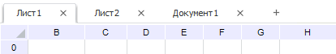

# Добавление нового листа и работа с ним: Регламентный отчёт, настольное приложение

Добавление нового листа и работа с ним: Регламентный отчёт, настольное приложение
-

# Добавление нового листа и работа
 с ним

Регламентный отчёт состоит из листов с данными. Каждый лист имеет свою
 вкладку, на которой отображено наименование листа. Количество листов в
 отчёте не ограничено.

Если отчёт предполагает наличие одного листа перейдите к шагу «[Выбор
 источников данных и работа с ними](../Source/UiReport_Source.htm)». Если для отчёта требуется несколько
 листов, то [добавьте](UiReport_Sheets_Create.htm) требуемое
 количество листов.

[Переход по листам
 отчёта](javascript:TextPopup(this))

	Для перехода к нужному листу выделите его вкладку или воспользуйтесь
	 клавишами:

		- для перехода к предыдущему листу CTRL+PAGE UP;

		- для перехода к следующему листу CTRL+PAGE DOWN.

[Работа с листами
 отчёта](javascript:TextPopup(this))

	При работе с листами отчёта возможны операции:

		- [добавление листа отчёта](UiReport_Sheets_Create.htm);

		- [дублирование листа](UiReport_Sheets_Create.htm#copy);

		- [переименование листа](UiReport_Sheets_rename.htm);

		- [перемещение/копирование
		 листа](UiReport_Sheets_Copy.htm);

		- [защита листа](UiReport_Sheets_defence.htm);

		- [скрытие листа](UiReport_Sheets_hide.htm);

		- [удаление листа](UiReport_Sheets_Del.htm);

		- настройка [параметров
		 листа](../Tuning/UiReport_Tuning_sheets.htm).

[Работа с элементами
 листа отчёта](javascript:TextPopup(this))

	Для [работы с элементами листа](../Table/UiReport_Table.htm)
	 возможны операции:

		- [выделение
		 ячеек](../Table/UiReport_Table.htm#selection);

		- [операции
		 с ячейками](../Table/Work/UiReport_Table_Work_Union.htm);

		- [операции
		 со строками](../Table/OperationRow/UiReport_Table_Row.htm);

		- [операции
		 со столбцами](../Table/OperationColumn/UiReport_Table_Column.htm);

[Работа с данными
 на листе отчёта](javascript:TextPopup(this))

	При работе с данными на листах отчёта возможны операции:

		- [ввод
		 данных в ячейку листа](../Table/Work/UiReport_Table_Work_Data.htm);

		- [редактирование
		 содержимого ячеек](../Table/Work/UiReport_Table_Work_Data_Edit.htm);

		- [копирование
		 и вставка данных](../Table/Work/UiReport_Table_Work_insert.htm);

		- [фильтрация
		 и сортировка выделенного диапазона](../Reports/OperationReport/Work_with_data.htm#filter);

		- [добавление
		 примечания](../Table/Work/UiReport_Table_Work_Notice.htm);

		- [добавление
		 именованного диапазона](../Reports/OperationReport/UiReport_Reports_Operation_Name.htm);

		- [использование
		 формул](../organizational_management/Function/UiReport_Function.htm).

См. также:

[Начало
 работы с инструментом «Отчёты» в веб-приложении](../../Web/organizational_management/Starting.htm) | [Построение
 отчёта](../CreateReport.htm)

		Справочная
		 система на версию 10.9
		 от 18/08/2025,
		 © ООО «ФОРСАЙТ»,
