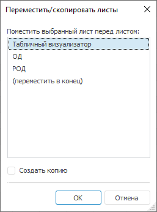

# Перемещение/копирование листа: Регламентный отчёт, настольное приложение

Перемещение/копирование листа: Регламентный отчёт, настольное приложение
-

# Перемещение/копирование листа

Для перемещения/копирования существующего листа:

	- выполните команду «Формат
	 > Переместить или скопировать
	 лист», расположенную в группе «Ячейки»
	 на вкладке «Главная» ленты
	 инструментов;

	- выполните команду «Переместить/Скопировать»
	 контекстного меню вкладки выбранного листа.

После выполнения команды откроется окно «Переместить/скопировать
 листы»:

В открывшемся окне:

	- Выделите в списке лист, перед которым должен быть вставлен лист
	 или его копия.

	- Установите/снимите флажок «Создать
	 копию». При снятом флажке после нажатия на кнопку «ОК»
	 произойдет перемещение листа в выбранную позицию. При установленном
	 флажке лист будет скопирован, и его копия будет помещена в выбранную
	 позицию. Копия листа автоматически получает наименование «Название
	 листа 1». По умолчанию флажок снят.

Для перемещения выбранного листа в конец списка выполните команду «Переместить в конец».

## Особенности при копировании листов отчёта

При копировании листа отчёта существует возможность создания копий всех
 объектов, расположенных на листе отчёта. Для некоторых объектов существует
 ряд особенностей:

	- Области формул. При
	 копировании области формул производится корректировка формул: если
	 в формуле вида «"Лист1"!A0»
	 есть ссылка на этот же лист, то формула будет приводиться к виду «"Лист11"!A0». При наличии
	 ссылки на какой-либо другой лист формула не корректируется. Если в
	 формуле содержится ссылка на именованный диапазон, корректируется
	 наименование диапазона;

	- Именованные диапазоны.
	 Наименование именованного диапазона должно быть уникально в рамках
	 каждого листа отчёта. При копировании наименования именованных диапазонов
	 не корректируются;

	- Диаграммы и 3D-сцены.
	 При копировании [диаграмм](../Diagrams/UiReport_Diagrams_appointment.htm)
	 и [3D-сцен](../Objects/UiReport_Objects_3D.htm) производится
	 корректировка ссылок на исходные данные: при копировании листа «Лист1» с расположенной на нем диаграммой
	 или 3D-сценой происходит корректировка ссылки на исходные данные для
	 диаграммы или 3D-сцены на листе «Лист11».
	 Если диаграмма или 3D-сцена на листе «Лист1»
	 ссылается не на текущий лист «Лист1»,
	 то корректировка ссылки на исходные данные при копировании текущего
	 листа не производится.

См. также:

[Начало
 работы с инструментом «Отчёты» в веб-приложении](../../Web/organizational_management/Starting.htm) | [Добавление
 нового листа и работа с ним](UiReport_Sheets.htm)

		Справочная
		 система на версию 10.9
		 от 18/08/2025,
		 © ООО «ФОРСАЙТ»,
