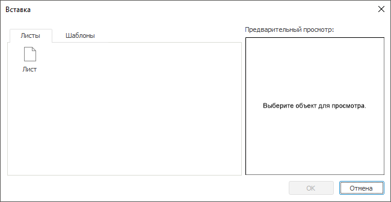

# Добавление листа отчёта: Регламентный отчёт, настольное приложение

Добавление листа отчёта: Регламентный отчёт, настольное приложение
-

# Добавление листа отчёта

Для быстрого добавления листа в отчёт:

	- нажмите кнопку ,
	 расположенную рядом с [вкладками
	 листов](../organizational_management/Starting.htm). Будет добавлен лист с наименованием по умолчанию. По умолчанию
	 наименование листа «Лист N»,
	 где N - порядковый номер добавляемого листа;

	- выполните команду контекстного меню «Добавить
	 лист» на [вкладке
	 листа](../organizational_management/Starting.htm). После выполнения действия будет открыто окно «Вставка»:

Для добавления листа выберите «Лист»
 на вкладке «Листы» в окне «Вставка».

# Дублирование листа отчёта

Для создания точной копии листа отчёта выполните команду контекстного
 меню «Дублировать» контекстного
 меню вкладки выбранного листа.

В результате выполнения команды будет создана точная копия листа.

См. также:

[Начало
 работы с инструментом «Отчёты» в веб-приложении](../../Web/organizational_management/Starting.htm) | [Добавление
 нового листа и работа с ним](UiReport_Sheets.htm)

		Справочная
		 система на версию 10.9
		 от 18/08/2025,
		 © ООО «ФОРСАЙТ»,
