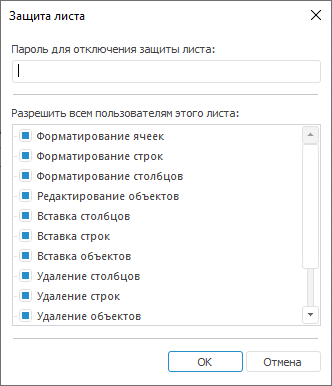

# Защита листа: Регламентный отчёт, настольное приложение

Защита листа: Регламентный отчёт, настольное приложение
-

# Защита листа

Защита используется для ограничения возможных действий пользователя
 в случае необходимости.

Защита листа не предполагает защиту содержимого ячеек. Для защиты содержимого
 ячейки (ячеек) от редактирования в диалоге форматирования на вкладке «[Прочее](UiNav.chm::/GUI/Format/UiReport_Table_Attribute_Others.htm)» установите
 флаг «Защищаемая ячейка».

## Установка защиты листа

Для установки защиты листа:

	- выполните команду «Формат >
	 Установить защиту листа» в
	 группе «Ячейки» на вкладке
	 «Главная» ленты инструментов;

	- выполните команду «Установить
	 защиту листа» контекстного меню вкладки выбранного листа.

Откроется окно «Защита листа»:

В открывшемся окне выберите те действия, которые пользователь может
 производить с листом. Установленный флажок соответствует разрешенному
 действию. По умолчанию установлены все флажки. Снятие флажков соответствует
 запрещению действия.

Примечание.
 При снятии флажков «Редактирование объектов»,
 «Удаление объектов» и «Перемещение
 объектов» одновременно не будет возможности выделить объекты, расположенные
 на листе отчёта.

После определения набора действий введите пароль для отключения защиты
 листа в поле, расположенном в верхней части окна.

Нажмите кнопку «ОK», появится
 окно подтверждения пароля.

## Снятие защиты листа

Для снятия защиты:

	- выполните команду «Формат >
	 Снять защиту листа» в группе «Ячейки»
	 на вкладке «Главная» ленты
	 инструментов;

	- выполните команду «Снять защиту
	 листа» контекстного меню вкладки выбранного листа.

В открывшемся окне «Снятие защиты листа»
 введите пароль. При положительном ответе и при условии, что пароль был
 введен верно, защита листа будет снята, и пользователю будут доступны
 все действия, производимые с отчётом.

Если пароль введен неверно, появится сообщение об ошибке, защита листа
 останется включенной.

См. также:

[Начало
 работы с инструментом «Отчёты» в веб-приложении](../../Web/organizational_management/Starting.htm) | [Добавление
 нового листа и работа с ним](UiReport_Sheets.htm)

		Справочная
		 система на версию 10.9
		 от 18/08/2025,
		 © ООО «ФОРСАЙТ»,
