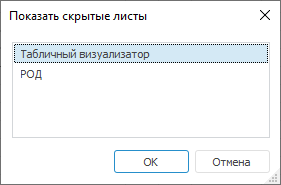

# Скрытие листа: Регламентный отчёт, настольное приложение

Скрытие листа: Регламентный отчёт, настольное приложение
-

# Скрытие листа

Скрытие применяют для листов, содержащих промежуточные итоги. Скрытые
 листы не отображаются в рабочей области, не выводятся на предварительный
 просмотр и печать, их можно экспортировать только в формат XLS.

В регламентном отчёте можно [переходить](../../FAQ/UiReport_Faq_q14_hyperlink.htm)
 на скрытые листы с помощью [гиперссылки](UiNav.chm::/GUI/Format/UiReport_Table_Attribute_Hyperlink.htm).

## Добавление скрытия для листа

Для скрытия листа выполните команду контекстного меню «Скрыть»
 для вкладки листа.

Примечание.
 При скрытии листа автоматически будет снят флажок «Печатать
 лист вместе с отчетом» в [параметрах
 страницы](../Tuning/ParamPage/UiReport_Tuning_ParamPage.htm) на вкладке «[Печать](../Tuning/ParamPage/UiReport_Tuning_ParamPage_4.htm)»,
 при последующем отображении листа флажок не восстанавливается.

## Отображение скрытых листов

Для отображения листов выполните команду контекстного меню «Отобразить»
 для вкладки листа. В появившемся окне выберите листы, которые требуется
 отобразить в рабочей области:

Примечание.
 Пункт «Отобразить» будет доступен
 в контекстном меню для вкладки меню, если есть скрытые листы.

См. также:

[Начало
 работы с инструментом «Отчёты» в веб-приложении](../../Web/organizational_management/Starting.htm) | [Добавление
 нового листа и работа с ним](UiReport_Sheets.htm)

		Справочная
		 система на версию 10.9
		 от 18/08/2025,
		 © ООО «ФОРСАЙТ»,
