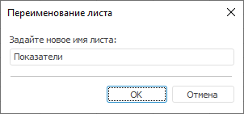

# Переименование листа: Регламентный отчёт, настольное приложение

Переименование листа: Регламентный отчёт, настольное приложение
-

# Переименование листа

Для переименования выбранного листа отчёта:

	- выполните команду «Формат
	 > Переименовать лист»,
	 расположенную в группе «Ячейки»
	 на вкладке «Главная» ленты
	 инструментов;

	- выполните команду «Переименовать»
	 контекстного меню вкладки выбранного листа.

После выполнения одного из действий будет открыто окно «Переименование
 листа»:

Задайте новое имя выбранного листа в соответствующем поле.

При переименовании листа осуществляется автоматическая корректировка
 формул, ссылающихся на переименованный лист. Например, формула «=B0+1+"Лист2"!A0» после
 переименования листа «Лист2» на
 «Data» принимает вид: «=B0+1+"Data"!A0».

Наименование листа может быть сохранено на разных языках в зависимости
 от текущего языка, выбранного в [окне регистрации](getstarted.chm::/GetStarted/Get_Started.htm).
 Для получения подробной информации обратитесь к разделу «[Настройка
 мультиязычности](UiNav.chm::/Multilanguage/Multilanguage_setting.htm)».

См. также:

[Начало
 работы с инструментом «Отчёты» в веб-приложении](../../Web/organizational_management/Starting.htm) | [Добавление
 нового листа и работа с ним](UiReport_Sheets.htm)

		Справочная
		 система на версию 10.9
		 от 18/08/2025,
		 © ООО «ФОРСАЙТ»,
