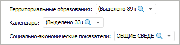
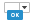
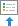
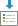

# Работа с интерактивными элементами управления: Регламентный отчёт, настольное приложение

Работа с интерактивными элементами управления: Регламентный отчёт, настольное приложение
-

# Добавление интерактивных элементов
 управления содержимым отчёта

Элемент управления - объект,
 предназначенный для управления данными, отображаемыми объектами отчета,
 позволяет изменить отмеченные элементы измерения или параметр отчета.

[Отображение
 панели «Элементы управления»](javascript:TextPopup(this))

	Для отображения/скрытия панели нажмите кнопку 
	 «Элементы управления», расположенную:

		- в группе «Инструменты и
		 панели» на вкладке «Вид»
		 ленты инструментов, если отчет был открыт в [режиме
		 редактирования](../organizational_management/Starting.htm#open);

		- в группе «Вид» на
		 вкладке «Главная», если
		 отчет открыт в [режиме
		 просмотра](../organizational_management/Starting.htm#open).

	При работе в режиме редактирование доступен выбор варианта расположения
	 панели на листе отчета:

		- . Панель размещается горизонтально по
		 верхней границе отчета;

		- . Панель размещается
		 вертикально по правой границе отчета;

		- . Панель размещается
		 горизонтально по нижней границе отчета;

		- . Панель размещается
		 вертикально по левой границе отчета;

		- . Панель «Элементы
		 управления» не отображается.

	Расположение панели «Элементы управления»
	 настраивается для всего отчета.

## Настройка элементов управления

Настройка элементов управления происходит в [режиме
 редактирования](../organizational_management/Starting.htm#open) и включает следующие операции:

[Добавление
 элемента управления](javascript:TextPopup(this))

	Для добавления элемента управления:

		- нажмите кнопку 
		 «Элемент управления»,
		 расположенную в группе «Области
		 данных» на вкладке «Вставка»
		 ленты инструментов;

		- выполните команду контекстного меню «Добавить»
		 на панели «Элементы управления»;

		- при использовании [области
		 данных](../AreaData/UiReport_AreaData.htm), перетащите измерение с панели «[Источники и срезы данных](UiReport_Source.htm#old)»
		 на панель «Элементы управления»,
		 используя механизм Drag&Drop.

	После выполнения одного из действий на панель будет добавлен элемент
	 управления.

[Редактирование
 элемента управления](javascript:TextPopup(this))

	Для [редактирования свойств](UiReport_Source_ControlProp.htm)
	 выбранного элемента управления:

		- выполните команду «Свойства»
		 в контекстном меню на панели «Элементы
		 управления»;

		- выделите элемент управления и перейдите на группу вкладок
		 «[Формат](UiReport_Source_ControlProp.htm)»
		 на [боковой
		 панели](GetStarted.chm::/Interface/Interface_Description.htm#side_panel).

	После выполнения одного из действий внесите требуемые изменения.

[Изменение
 порядка элементов управления](javascript:TextPopup(this))

	Порядок элементов управления настраивается отдельно для каждого
	 листа отчета.

	Для смены порядка в списке элементов управления при горизонтальном
	 [расположении](#panel_layout) панели:

		- выполните команду «Влево»
		 или «Вправо» в контекстном
		 меню выбранного элемента управления;

		- перетащите элемент управления в нужную позицию, используя
		 механизм Drag&Drop.

	Для смены порядка в списке элементов управления при вертикальном
	 [расположении](#panel_layout) панели:

		- выполните команду «Вверх»
		 или «Вниз» в контекстном
		 меню выбранного элемента управления;

		- перетащите элемент управления в нужную позицию, используя
		 механизм Drag&Drop.

	После выполнения одного из действий будет изменен порядок расположения
	 элементов управления.

	Совет. Для настройки
	 отображения элемента управления на конкретном листе отчета используйте
	 параметр «[Отображать
	 для листа](UiReport_Source_ControlProp.htm#parameters_of_displaying)».

[Удаление
 элемента управления](javascript:TextPopup(this))

	Для удаления выбранного элемента управления выполните команду контекстного
	 меню «Удалить» на панели «Элементы управления».

При добавлении/редактировании элементов управления будет открыта вкладка
 «[Элемент
 управления](UiReport_Source_ControlProp.htm)» боковой панели.

## Работа с интерактивными элементами управления

Элементы управления располагаются [рядом
 с рабочей областью](../organizational_management/Starting.htm) и позволяют изменять отметку измерений или параметра
 отчета, в том числе при открытии отчета в [режиме
 просмотра](../organizational_management/Starting.htm#open).

Элемент управления отображает выбранное измерение [в
 заданном виде](UiReport_Source_ControlProp.htm#parameters_of_displaying) (например, в виде раскрывающегося списка), с возможностью
 [поиска](UiSelection.chm::/Selection/Dimension.htm#search)
 по измерению.

См. также:

[Начало
 работы с инструментом «Отчёты» в веб-приложении](../../Web/organizational_management/Starting.htm) | [Построение
 отчёта](../CreateReport.htm)

		Справочная
		 система на версию 10.9
		 от 18/08/2025,
		 © ООО «ФОРСАЙТ»,
