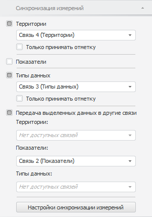

# Синхронизация измерений в срезах данных

Синхронизация измерений в срезах данных
-

# Синхронизация измерений в срезах данных

Синхронизация измерений позволяет управлять отметкой элементов сразу
 в нескольких объектах, использующих различные срезы данных.

Синхронизация выполняется с помощью связей между измерениями срезов
 данных, используемых объектами. Если несколько объектов используют один
 и тот же срез в качестве источника данных, то настройки синхронизации
 для данных объектов будут совпадать. Для корректной настройки синхронизируемые
 измерения срезов должны быть построены на одном справочнике.

Связи могут быть двух видов:

	- двусторонние. Связь
	 может как принимать, так и передавать отметку в управляемые срезы;

	- односторонние. Связь
	 может только принимать отметку от других срезов, с которыми настроена
	 синхронизация.

Примечание.
 Синхронизация измерений не настраивается автоматически, даже если создаются срезы,
 настроенные на один источник данных. Все настройки синхронизации определяются
 пользователем.

Для настройки синхронизации измерений используйте вкладку «Синхронизация
 измерений» на боковой панели.

[Для отображения
 вкладки](javascript:TextPopup(this))

		- Убедитесь, что боковая панель отображается.

		- В рабочей области выберите объект, для которого доступна
		 синхронизация.

		- Если выделена таблица, то на боковой панели установите переключатель
		 «Таблица», если выделена
		 карта или диаграмма, то переключатель «Формат».

		- Перейдите на вкладку «Синхронизация
		 измерений».

На вкладке присутствуют две группы настроек:

	- настройки для синхронизации
	 отметки. Для настройки синхронизации отметки на вкладке содержится
	 список измерений среза данных, используемого объектом. Каждому измерению
	 соответствует флажок:

		- Флажок установлен.
		 Измерению сопоставляется связь. Наименование связи формируется
		 по схеме: Связь <номер_связи>
		 (<наименование_управляемого_измерения>). Если одному
		 и тому же измерению в нескольких срезах сопоставлена одна и та
		 же связь, то измерение синхронизируется и изменение отметки в
		 одном срезе будет влиять на отметку в других срезах.

		Для создания новой связи выберите элемент «<Новая
		 связь>» в раскрывающемся списке требуемого измерения.
		 Элемент доступен, если данное измерение синхронизировано в двух
		 и более срезах.

		После установки флажка, соответствующего измерению, отображается
		 дополнительный флажок:

			- Только принимать отметку.
			 По умолчанию флажок снят. Установка флажка означает, что связь
			 будет односторонней и текущий срез не будет передавать свою
			 отметку в связи, а будет только принимать их из связанных
			 срезов;

		- Флажок снят. Используется
		 по умолчанию. Измерение независимо. Изменение отметки элементов
		 не влияет на другие срезы. Изменение отметки по данному измерению
		 в других срезах не влияет на отметку элементов в настраиваемом
		 срезе;

	- настройки для синхронизации
	 выделения данных. Синхронизация выделенных данных позволяет,
	 например, перестраивать диаграмму в соответствии с выделением в таблице.
	 Для настройки синхронизации выделения данных установите флажок «Передача выделенных данных в другие связи».
	 Будет отображен список измерений настраиваемого среза данных. Каждому
	 измерению соответствует раскрывающийся список, содержащий доступные
	 связи.

	Если для измерения выбрана связь, значит изменение выделения данных
	 в измерении будет приводить к изменению отметки в измерениях, которым
	 сопоставлена выбранная связь.

	Выбор связи доступен, если для настраиваемого измерения не задана связь
	 для синхронизации отметки.

Совет. Для настройки
 синхронизации измерений во всех срезах регламентного отчета нажмите кнопку
 «Настройки синхронизации измерений».
 На боковой панели будет открыта вкладка «[Синхронизация измерений документа](Sync_dimentions_report.htm)».

См. также:

[Начало
 работы с инструментом «Отчёты» в веб-приложении](../../../Web/organizational_management/Starting.htm) | [Настройка измерений](UiReport_Dim_Change_mark.htm)

		Справочная
		 система на версию 10.9
		 от 18/08/2025,
		 © ООО «ФОРСАЙТ»,
