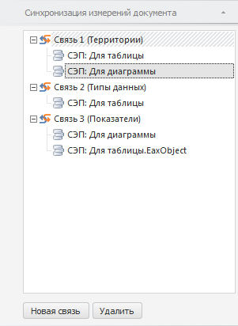

# Синхронизация измерений отчета

Синхронизация измерений отчета
-

# Синхронизация измерений отчета

Синхронизация измерений позволяет управлять отметкой элементов сразу
 в нескольких объектах, использующих различные срезы данных.

Синхронизация выполняется с помощью связей между измерениями среза данных,
 используемого объектом. Если несколько объектов используют один и тот
 же срез в качестве источника данных, то настройки синхронизации для данных
 объектов будут совпадать. Для корректной настройки синхронизируемые измерения
 срезов должны быть построены на одном справочнике.

Для настройки синхронизации всех срезов, используемых в регламентном
 отчете, используйте вкладку боковой панели «Синхронизация
 измерений документа».

[Для отображения
 вкладки](javascript:TextPopup(this))

		- Убедитесь, что боковая панель отображается.

		- Щелкните по пустому пространству в рабочей области.

		- На боковой панели вберите группу вкладок «Документ».

		- Перейдите на вкладку «Синхронизация
		 измерений документа».

На вкладке содержится список связей измерений для всех срезов регламентного
 отчета. На основании любого измерения среза можно создать только одну
 связь. На основании одного и того же измерения в составе различных срезов
 можно создать как одну, так и несколько связей.

Наименование связи формируется по схеме: Связь
 <номер_связи> (<наименование_измерения>). Для каждой
 связи приведен список срезов, использующих данную связь.

[Для создания
 новой связи](javascript:TextPopup(this))

		- Перейдите на вкладку «Синхронизация
		 измерений документа» на боковой панели.

		- Выделите срез, на основании которого требуется создать новую
		 связь.

		- Нажмите кнопку «Новая связь»
		 или перетащите выбранную связь в конец списка связей.

	Выделенный срез будет исключен из связи. На основе выделенного среза
	 будет создана новая связь, которая будет отображена на вкладке «Синхронизация измерений документа».

[Для удаления
 связи](javascript:TextPopup(this))

		- Выберите требуемую связь.

		- Нажмите кнопку «Удалить».

	Выбранная связь будет удалена из всех срезов, в которых она используется
	 без запроса подтверждения выполняемого действия.

[Для исключения
 среза из связи](javascript:TextPopup(this))

		- Выберите требуемый срез.

		- Нажмите кнопку «Удалить».

	Выбранный срез будет исключен из связи без запроса подтверждения
	 выполняемого действия.

[Для перемещения
 среза из одной связи в другую](javascript:TextPopup(this))

	Переместить срез из одной связи в другую возможно, если данным связям
	 сопоставлено одно и тоже измерение.

	Для перемещения среза из одной связи в другую:

		- Выделите требуемый срез.

		- Зажмите кнопку мыши и перетащите выбранный срез
		 в требуемую связь.

	Связь будет перемещена в выбранный срез без запроса подтверждения
	 выполняемого действия.

См. также:

[Начало
 работы с инструментом «Отчёты» в веб-приложении](../../../Web/organizational_management/Starting.htm) | [Управление
 отметкой](../../Reports/Selection.htm)

		Справочная
		 система на версию 10.9
		 от 18/08/2025,
		 © ООО «ФОРСАЙТ»,
