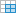
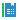
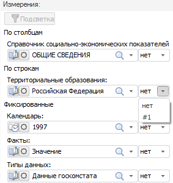

# Измерения области данных

Измерения области данных
-

# Измерения области данных

Настройка измерений для [области
 данных](../../AreaData/UiReport_AreaData.htm) доступна только в режиме редактирования и осуществляется с
 помощью панели «Источники и срезы данных».

Примечание.
 Настройка измерений для  [области данных](../../AreaData/UiReport_AreaData.htm) отличается
 от настройки измерений для 
 [табличного визуализатора](../../AreaData/DataTable.htm).

В области «Измерения» отображаются
 измерения источника, у которого выделен срез данных:

Область каждого измерения содержит:

	- список элементов измерения;

	- список для синхронизации отметки с аналогичными измерениями
	 в других срезах;

	- кнопки «Параметры измерения» ;

	- значки с типами справочников, на которых основано измерение
	 источника:

	-

		-  - табличный справочник;

		-  - календарный
		 справочник;

		-  - вычисляемый
		 справочник.

Список измерений разделен на группы расположения:

	- По столбцам. Содержит
	 список измерений, которые располагаются по столбцам таблицы;

	- По строкам. Содержит
	 список измерений, которые располагаются по строкам таблицы;

	- Фиксированные. Содержит
	 список зафиксированных измерений, которые не отображаются в таблице.

## Настройка измерения

Основными задачами при работе с измерениями являются настройка расположения
 измерения и настройка отметки измерения.

При настройке расположения с помощью области «Измерения»
 доступны следующие операции:

[Перенос
 измерения в другую группу](javascript:TextPopup(this))

	Для переноса измерения в другую группу расположения нажмите на значок
	 справочника и удерживая его перенесите измерение в другую группу.

При настройке отметки измерения доступно:

[Изменение
 отметки элемента измерения](javascript:TextPopup(this))

	Для изменения отметки элемента в области «Измерения»:

		- щёлкните по элементу;

		- переходя по элементам с помощью клавиш UP и DOWN,
		 нажмите клавишу ПРОБЕЛ.

[Изменение
 отметки диапазона элементов измерения](javascript:TextPopup(this))

	Для изменения отметки диапазон элементов в области «Измерения»
	 щёлкните по первому элементу диапазона. Щелкните по последнему
	 элементу диапазона, удерживая клавишу SHIFT.

[Изменение
 отметки элемента и всех подчиненных ему элементов](javascript:TextPopup(this))

	Для изменения отметки и всех подчиненных ему элементов в области
	 «Измерения»:

		- щелкните по родительскому элементу, удерживая клавишу CTRL;

		- выполните команду контекстного меню «Отметить
		 подчиненные»/«Снять отметку
		 с подчиненных» родительского элемента;

		- переходя по элементам с помощью клавиш UP и DOWN,
		 нажмите клавишу ПРОБЕЛ, удерживая клавишу CTRL.

[Изменение
 отметки всех элементов уровня](javascript:TextPopup(this))

	Для изменения отметки для всех элементов, расположенных на одном
	 уровне с указанным элементом, в области «Измерения»
	 выполните команду контекстного меню «Отметить
	 уровень»/«Снять отметку с
	 уровня» элемента.

[Изменение
 отметки всех элементов в измерении](javascript:TextPopup(this))

	Для изменения отметки всех элементов измерения в области «Измерения» выполните команду контекстного
	 меню «Отметить все»/«Снять отметку» родительского элемента.

[Копирование
 отметки](javascript:TextPopup(this))

	Между измерениями регламентного отчета, экспресс-отчета и базы данных
	 временных рядов доступны копирование и вставка отметки элементов,
	 если измерения основаны на одном источнике данных.

	Для копирования отметки элементов в буфер обмена:

		- выполните команду контекстного меню «Копировать»;

		- нажмите сочетание клавиш CTRL+C, CTRL+INSERT.

	Для вставки отметки элементов из буфера обмена:

		- выполните команду контекстного меню «Вставить»;

		- нажмите сочетание клавиш CTRL+V, SHIFT+INSERT.

	При выполнении команды отметка из буфера обмена замещает текущую
	 отметку в измерении. Для дополнения существующей отметки выполняйте
	 команду с зажатой клавишей CTRL.

[Синхронизация
 отметки элементов измерений разных срезов](javascript:TextPopup(this))

	Синхронизация измерений позволяет управлять отметкой элементов сразу
	 в нескольких объектах, использующих различные срезы данных.

	Настройка синхронизации доступна для [области
	 данных](../../AreaData/UiReport_AreaData.htm) и [диаграммы](../../Diagrams/UiReport_Diagrams_appointment.htm)
	 или [карты](../../Maps/svgmap.htm), построенных на срезе
	 области данных.

	Для настройки синхронизации измерений используйте панель «[Источники
	 и срезы данных](../UiReport_Source.htm)». Для отображения панели нажмите кнопку
	  «Источники
	 и срезы данных» в группе «Инструменты
	 и панели» на вкладке «Вид»
	 ленты инструментов.

	В области «Измерения» в
	 раскрывающемся списке, располагающемся в правой колонке от измерения,
	 выберите номер синхронизации (# 1, # 2, # 3, и так далее):

	

	Для синхронизации одинаковых измерений в различных срезах установите
	 одинаковые номера синхронизации. В результате, изменение отметки в
	 одном из измерений будет приводить к установке аналогичной отметки
	 во всех остальных измерениях, синхронизированных с ним.

[Выбор
 схемы отметки](javascript:TextPopup(this))

	Для выбора схемы отметки должны быть настроены [схемы
	 отметки](UiNavObj.chm::/reference_book/look-and-feel_Reference_book/uimd_reference_book_look-and-feel_scheme.htm).

	Для установки отметки для группы элементов выполните команду
	 контекстного меню «Отметить группу»
	 элемента измерения в области «Измерения».

	Примечание.
	 Пункт «Отметить группу» будет
	 скрыт из контекстного меню, если выбрана группа в раскрывающемся меню
	 пункта «Отобразить группу».

	Для использования данной схемы отметки при открытии отчета установите
	 флажок «Применять только при открытии».

	Примечание.
	 При совместном использовании «Группы
	 элементов» и «Схемы отметки»
	 для одного измерения необходимо учитывать, что результатом будет являться
	 их взаимодействие. В выбранной группе элементов будут отмечены те
	 элементы, которые соответствуют выбранной схеме отметки.

[Установка
 отметки для группы элементов](javascript:TextPopup(this))

	Для работы с группой элементов:

		- для справочника, на котором основано измерение источника,
		 должны быть настроены [группы
		 элементов](UiNavObj.chm::/reference_book/look-and-feel_Reference_book/UiMd_reference_book_look-and-feel_Group.htm);

		- измерение должно быть не зафиксировано, либо настроена [агрегация по фиксированным
		 измерениям](../Window/UiReport_Cache.htm).

	Примечание.
	 При совместном использовании «Группы
	 элементов» и «Схемы отметки»
	 для одного справочника необходимо учитывать, что результатом будет
	 являться их взаимодействие. В выбранной группе элементов будут отмечены
	 те элементы, которые соответствуют выбранной схеме отметки.

	Для установки отметки для группы элементов в области «Измерения»
	 выполните команду «Отметить группу»
	 контекстного меню элемента справочника;

	Примечание.
	 Пункт «Отметить группу» будет
	 скрыт из контекстного меню, если выбрана группа в раскрывающемся меню
	 пункта «Отобразить группу».

	Во всплывающем меню выберите группу элементов.

	Примечание.
	 Всплывающее меню пункта «Отметить
	 группу» отображает только десять последних использовавшихся
	 групп. Если для измерения определено более десяти групп, то в меню
	 будет присутствовать команда «Другая
	 группа». В открывшемся диалоге «Выбор
	 группы элементов» выберите группу элементов.

[Настройка
 параметров измерения](javascript:TextPopup(this))

	Для настройки параметров измерения нажмите кнопку  в области «[Измерения](../UiReport_Source.htm#old)» напротив необходимого
	 справочника. Появится окно «Параметры измерения»:

	

	Задайте в окне параметры измерений:

		- Группы элементов и схемы
		 отметки. Определите настройки групп элементов и схем отметок
		 для измерения:

			- Группа элементов.
			 В раскрывающемся списке выберите группу элементов. Отметка
			 группы элементов доступна, если для справочника настроены
			 [группы
			 элементов](UiNavObj.chm::/reference_book/look-and-feel_Reference_book/UiMd_reference_book_look-and-feel_Group.htm);

			- Схема отметки.
			 В раскрывающемся списке выберите схему отметки. Отметка схемы
			 отметки доступна, если для справочника настроены [схемы
			 отметки](UiNavObj.chm::/reference_book/look-and-feel_Reference_book/UiMd_reference_book_look-and-feel_Scheme.htm);

			- Применять только при
			 открытии. При установленном флажке группы элементов
			 и схемы отметки будут использоваться при открытии отчета;

		- Множественная отметка для
		 фиксированных измерений. Определите настройки множественной
		 отметки для фиксированных измерений:

			- Разрешить агрегацию
			 данных. При установленном флажке будет доступна агрегация
			 данных;

			- Метод. Выберите
			 метод агрегации из раскрывающегося списка.

	Более подробное описание смотрите в разделе
	 «[Настройка
	 агрегации в фиксированных измерениях](../Window/UiReport_Cache.htm)».

Так же при работе с измерениями доступны [настройка
 агрегации в фиксированных измерениях](../Window/UiReport_Cache.htm) и [работа
 со списком в измерении](UiReport_Dim.htm).

См. также:

[Начало
 работы с инструментом «Отчёты» в веб-приложении](../../../Web/organizational_management/Starting.htm) | [Выбор
 источников данных и работа с ними](../UiReport_Source.htm) | [Работа
 со списком в измерении](UiReport_Dim.htm)

		Справочная
		 система на версию 10.9
		 от 18/08/2025,
		 © ООО «ФОРСАЙТ»,
