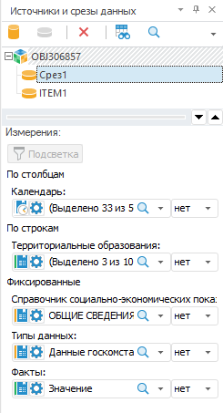

# Выбор источников данных и работа с ними: Регламентный отчёт, настольное приложение

Выбор источников данных и работа с ними: Регламентный отчёт, настольное приложение
-

# Выбор источников данных и работа
 с ними

Регламентный отчёт может оперировать одним или несколькими источниками
 данных.

Работа с источниками данных отличается в зависимости от используемого
 [типа таблицы](../AreaData/Table_Types.htm):

	- [Табличный
	 визуализатор](../AreaData/DataTable.htm). Для работы используется боковая панель;

	- [Область
	 данных](../AreaData/UiReport_AreaData.htm). Устаревший тип таблицы с данными. Для работы используется
	 панель «[Источники
	 и срезы данных](UiReport_Source.htm#old)».

Примечание.
 Панель «[Источники
 и срезы данных](UiReport_Source.htm#old)» является устаревшей и используется для совместимости
 с версиями Prognoz Platform.

[Панель
 «Источники и срезы данных»](javascript:TextPopup(this))

	Для управления источниками и срезами данных [области
	 данных](../AreaData/UiReport_AreaData.htm) используйте панель «Источники
	 и срезы данных»:

	

	Для отображения панели нажмите кнопку  «Источники и срезы данных», расположенную
	 в группе «Инструменты и панели»
	 на вкладке «Вид» ленты инструментов.

	Панель включает области:

		- Источники и срезы данных.
		 Содержит список источников данных. Используется для создания [срезов
		 для области данных](Window/UiReport_Source_Window_AreaSource.htm#add_slice1);

		- Измерения. Используется
		 для настройки [измерений
		 области данных](Dim/UiReport_Dim_Change_mark.htm).

	Совет. Панель
	 «Источники и срезы данных»
	 является устаревшей и используется для совместимости с прошлыми версиями
	 «Форсайт. Аналитическая платформа».

В качестве источников данных можно использовать:

	- все [виды
	 кубов](UiNavObj.chm::/Cube/UiMd_Cube_Type.htm),
	 включая дочерние кубы контейнера моделирования;

	- [экспресс-отчёты](UiExpress.chm::/purpose/UiExpress_Purpose.htm);

	- [базы
	 данных временных рядов](uidw.chm::/UiDw_Title.htm);

	- [переменные
	 моделирования](uimodelling.chm::/2_container_of_modeling/2_3_work_object/2_3_1_value/uimodelling_work_object_value.htm);

	- [наборы
	 данных](UiNavObj.chm::/Table/Master/object_type_page.htm). Используются для создания [реляционной
	 области данных](../Relational_data_area/UIReport_Relational_data_area.htm).

Для отображения нужных данных настройте размещение измерений источника
 данных на вкладке «[Структура
 источника данных](../Reports/Parameters_DataSource.htm)» окна «Параметры».

## Добавление источника данных

Для добавления источника данных:

	- с помощью механизма Drag&Drop перетащите источник данных,
	 выбранный на панели «[Объекты репозитория](../organizational_management/Starting.htm)»,
	 на вкладку «Источники» группы
	 вкладок «Документ» [боковой
	 панели](GetStarted.chm::/Interface/Interface_Description.htm#side_panel) или на [лист
	 отчёта](../Table/UiReport_Table.htm);

	- выберите пункт  «Добавить источник»:

		- в меню 
		 вкладки «Источники» группы
		 вкладок «Документ» на
		 боковой панели;

		- в контекстном меню пустой области на вкладке «Источники»
		 группы вкладок «Документ»
		 боковой панели;

		- на вкладке «Источники»
		 ленты инструментов.

Будет открыто стандартное окно выбора объектов
 репозитория. Выберите требуемый источник данных. В списке объектов репозитория
 по умолчанию установлен фильтр «Все доступные
 объекты» и доступна множественная отметка;

	- используйте группу кнопок «Получение
	 данных» на вкладке «Данные»
	 ленты инструментов. Выберите тип источника: «Из
	 репозитория» или «Из файла».
	 После выбора типа источника будет открыт стандартный диалог выбора
	 файла.

Добавленный источник данных будет отображаться на [боковой
 панели](GetStarted.chm::/Interface/Interface_Description.htm#side_panel) и на панели «[Источники
 и срезы данных](UiReport_Source.htm#old)».

Для открытия добавленного источника данных на редактирование выделите
 источник данных и выполните команду «Редактировать»
 в контекстном меню источника.

Примечание.
 Редактирование источника данных может быть отключено с помощью встроенного
 языка программирования [Fore](UiLib.chm::/Interface/IUiCommandActionCustomize/IUiCommandActionCustomize.htm).

См. также:

[Начало
 работы с инструментом «Отчёты» в веб-приложении](../../Web/organizational_management/Starting.htm) | [Построение
 отчёта](../CreateReport.htm)

		Справочная
		 система на версию 10.9
		 от 18/08/2025,
		 © ООО «ФОРСАЙТ»,
