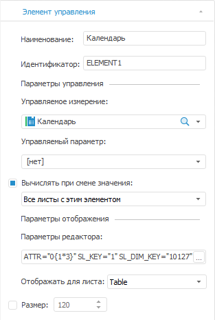

# Настройки элементов управления

Настройки элементов управления
-

# Настройки элементов управления

При добавлении/редактировании [элементов управления](Controls.htm)
 будет открыта вкладка «Элемент управления»
 [боковой
 панели](GetStarted.chm::/Interface/Interface_Description.htm#side_panel):

Определите на вкладке настройки элемента управления:

	- Наименование. Задайте
	 наименование элемента управления;

	- Идентификатор. Задайте
	 уникальный идентификатор элемента управления. Идентификатор может
	 состоять только из букв латинского алфавита, цифр и символа подчеркивания;

	- Параметры управления.
	 В области «Параметры управления»
	 задайте:

		- Управляемое измерение.
		 Из раскрывающегося списка выберите измерение, которым будет управлять
		 элемент управления.

Для удаления управляемого измерения выберите
 раскрывающийся список и нажмите клавишу DELETE;

Примечание.
 Если в качестве управляемого измерения выбрано календарное измерение,
 то при работе с отметкой в [элементе управления](Controls.htm)
 будет доступен выбор режима отметки: «Только
 по элементам», «Только по уровням»
 или «По элементам и уровням».
 Работа с отметкой в таком элементе управления аналогична работе с [отметкой
 элементов календарного измерения](UiSelection.chm::/Selection/Selection_of_the_CalendarDimension_elements.htm).

Если для управляемого измерения назначена роль метрики, то для него будет
 доступна только единичная отметка.

		- Управляемый параметр.
		 По умолчанию в раскрывающемся списке отображается вариант «нет» и [параметры
		 отчёта](../Reports/UiReport_Reports_Param.htm), если они для него заданы. Если добавляемый параметр
		 отчёта связан с параметром источника, то добавление такого параметра
		 дает возможность управлять параметрами источников данных;

Примечание.
 При выборе управляемого параметра управляемое измерение можно не указывать.

		- Вычислять при смене значения.
		 По умолчанию флажок установлен. После установки флажка из раскрывающегося
		 списка выберите ту часть отчёта, которую требуется вычислять при
		 смене значения:

			- Только связанный срез;

			- Весь отчёт;

			- Все листы с этим элементом;

			- Конкретный лист текущего
			 отчёта.

Снятие флажка отменяет пересчёт среза/отчёта/листов/листа
 (в режиме просмотра) при смене значения элемента управления;

	- Параметры
	 отображения. В области «Параметры
	 отображения» задайте:

		- Параметры редактора.
		 В поле ввода задайте внешний вид элемента управления. Для определения
		 параметров редактора нажмите кнопку . Откроется
		 окно «[Параметры
		 редактора значений](UiNav.chm::/GUI/ValueEditorParameters.htm#dimension)»;

		- Отображать для листа.
		 Определите, на каких листах отчёта будет отображаться данный элемент
		 управления. Раскрывающийся список содержит наименования всех листов
		 текущего отчёта, а также пункт «Все
		 листы». В списке возможна множественная отметка листов.

		- Размер. При установленном
		 флажке появляется возможность задать фиксированную ширину элемента
		 управления. Задать ширину элемента управления можно также растянув
		 элемент управления за правый край.

См. также:

[Начало
 работы с инструментом «Отчёты» в веб-приложении](../../Web/organizational_management/Starting.htm) | [Добавление
 интерактивных элементов управления содержимым отчёта](Controls.htm)

		Справочная
		 система на версию 10.9
		 от 18/08/2025,
		 © ООО «ФОРСАЙТ»,
