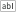
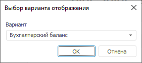

# Добавление срезов данных и работа с ними: Регламентный отчёт, настольное приложение

Добавление срезов данных и работа с ними: Регламентный отчёт, настольное приложение
-

# Добавление срезов данных и работа с ними

Многомерные источники данных делятся на срезы данных, используемые для
 построения [таблиц](../../AreaData/Table_Types.htm) и других
 [объектов](../../Objects/UiReport_Objects.htm) на [листе
 отчета](../../Table/UiReport_Table.htm). Работа со срезами данных отличается в зависимости от используемого
 [типа таблицы](../../AreaData/Table_Types.htm):

	- [Табличный
	 визуализатор](../../AreaData/DataTable.htm). Для работы используется [боковая
	 панель](../../organizational_management/Starting.htm). Наименование среза по умолчанию: «ITEM1». Наименование
	 среза может быть изменено пользователем;

	- [Область
	 данных](../../AreaData/UiReport_AreaData.htm). Устаревший тип таблицы с данными. Для работы используется
	 панель «[Источники
	 и срезы данных](../UiReport_Source.htm#old)». Наименование среза по умолчанию: «Срез1». Наименование
	 среза может быть изменено пользователем.

Примечание.
 При создании среза данных для других [объектов](../../Objects/UiReport_Objects.htm)
 используйте боковую панель.

В качестве источников данных можно использовать:

	- все [виды
	 кубов](UiNavObj.chm::/Cube/UiMd_Cube_Type.htm),
	 включая дочерние кубы контейнера моделирования;

	- [экспресс-отчеты](UiExpress.chm::/purpose/UiExpress_Purpose.htm);

	- [базы
	 данных временных рядов](uidw.chm::/UiDw_Title.htm);

	- [переменные
	 моделирования](uimodelling.chm::/2_container_of_modeling/2_3_work_object/2_3_1_value/uimodelling_work_object_value.htm);

	- [наборы
	 данных](UiNavObj.chm::/Table/Master/object_type_page.htm). Используются для создания [реляционной
	 области данных](../../Relational_data_area/UIReport_Relational_data_area.htm).

Созданные срезы будут отображаться на боковой панели и на панели «[Источники
 и срезы данных](../UiReport_Source.htm#old)».

Примечание.
 Панель «[Источники
 и срезы данных](../UiReport_Source.htm#old)» является устаревшей и используется для совместимости
 с версиями Prognoz Platform.

## Работа со срезами для табличного визуализатора

Операции, доступные над источниками и срезами данных:

[Добавление
 среза](javascript:TextPopup(this))

	Для добавления нового среза выберите источник данных на вкладке
	 «Источники» группы вкладок
	 «Документ» [боковой
	 панели](GetStarted.chm::/Interface/Interface_Description.htm#side_panel) и выполните команду 
	 «Добавить срез»:

		- в контекстном меню выбранного источника данных;

		- на вкладке «Источники»
		 ленты инструментов.

	После выполнения действия будет создан новый срез, которому по умолчанию
	 будет присвоено имя «ITEM N»,
	 где N - порядковый номер
	 среза.

	Срез необходим для [создания
	 табличного визуализатора](../../AreaData/DataTable.htm#create).

[Создание
 копии среза](javascript:TextPopup(this))

	Для создания копии среза выберите его на вкладке «Источники»
	 группы вкладок «Документ»
	 [боковой
	 панели](GetStarted.chm::/Interface/Interface_Description.htm#side_panel), выполните команду контекстного меню «Создать копию» и выберите вариант
	 создания копии среза:

		- Полностью. Копия
		 среза будет полностью аналогична оригинальному срезу;

		- Без отметки. Копия
		 среза унаследует от оригинального порядок расположения измерений
		 и их синхронизацию;

		- Без синхронизации.
		 Копия среза унаследует от оригинального порядок расположения измерений
		 и отметку в измерениях;

		- Без отметки и синхронизации.
		 Копия среза унаследует от оригинального только порядок расположения
		 измерений.

	После выполнения команды будет создана копия выбранного среза. По
	 умолчанию копии будет присвоено имя Срез
	 - Копия N, где Срез
	 - имя оригинального среза, N -
	 порядковый номер среза.

[Удаление
 источника и среза данных](javascript:TextPopup(this))

	Для удаления источника или среза данных на вкладке «Источники»
	 группы вкладок «Документ»
	 [боковой
	 панели](GetStarted.chm::/Interface/Interface_Description.htm#side_panel) выполните команду «Удалить»
	 в контекстном меню выбранного источника/среза.

	При удалении источников удаляются все дочерние объекты. Например,
	 для куба удаляются все срезы и все области. Все таблицы, которые были
	 построены на основании удаленного источника, также удаляются с листа.

	Для удаления всех срезов источника данных выделите источник и выполните
	 команду «Удалить все срезы»
	 в контекстном меню требуемого источника.

[Поиск
 источника или среза данных](javascript:TextPopup(this))

	Для поиска источника или среза данных по их наименованию используйте
	 вкладку «Источники» группы
	 вкладок «Документ» [боковой
	 панели](GetStarted.chm::/Interface/Interface_Description.htm#side_panel). Введите искомый текст в  поле для поиска.

	Для выделения на листе отчета [табличного
	 визуализатора](../../AreaData/DataTable.htm), соответствующего области данных табличного визуализатора
	 на боковой панели, перейдите на вкладку «Источники»
	 группы вкладок «Документ»
	 [боковой
	 панели](GetStarted.chm::/Interface/Interface_Description.htm#side_panel) и выполните команду «Показать
	 на листе» в контекстном меню требуемой области данных табличного
	 визуализатора.

[Переименование
 источника и среза данных](javascript:TextPopup(this))

	Для переименования источника/среза данных выберите его на вкладке
	 «Источники» группы вкладок
	 «Документ» [боковой
	 панели](GetStarted.chm::/Interface/Interface_Description.htm#side_panel) и выполните команду 
	 «Переименовать»:

		- в контекстном меню выбранного источника/среза данных;

		- на вкладке «Источники»
		 ленты инструментов.

	После выполнения данной команды введите новое наименование и нажмите
	 на клавишу ENTER.

	Примечание.
	 Команда «Переименовать» недоступна,
	 если на вкладке «Источники»
	 группы вкладок «Документ»
	 [боковой
	 панели](GetStarted.chm::/Interface/Interface_Description.htm#side_panel) в раскрывающемся списке «Отображение»
	 выбран вариант «Наименования и идентификаторы».

[Настройка
 вида отображения в списке](javascript:TextPopup(this))

	Для выбора вида отображения объектов (источников данных, срезов
	 и областей данных):

		- Перейдите на вкладку «Источники»
		 группы вкладок «Документ»
		 [боковой
		 панели](GetStarted.chm::/Interface/Interface_Description.htm#side_panel).

		- В раскрывающемся списке «Отображение»
		 выберите вид отображения объектов:

			- Отображать наименования.
			 Объекты отображаются под своими наименованиями;

			- Отображать идентификаторы.
			 Объекты отображаются под своими идентификаторами;

			- Отображать идентификаторы
			 и наименования. Объекты отображаются под своими именами,
			 в скобках указываются их идентификаторы.

	Выбранный вид отображения будет использоваться для всех объектов,
	 расположенных на вкладке «Источники»
	 группы вкладок «Документ»
	 боковой панели.

[Выбор
 варианта отображения данных](javascript:TextPopup(this))

	Варианты отображения данных позволяют управлять содержимым отчета.

	Для выбора варианта отображения данных в регламентном отчете:

		- Выполните команду «Варианты
		 отображения» в контекстном меню источника данных. Отобразится
		 раскрывающийся список, содержащий варианты отображения.

		- Выберите вариант отображения, требуемый в отчете:

			- если источником данных является куб, укажите вариант
			 [агрегации
			 по уровням измерений](UiNavObj.chm::/Cube/Agregation.htm).

			Если для различных вариантов отображения настроены агрегации
			 по измерениям, то существует возможность в зависимости от
			 выбранного варианта отображать в отчете разную агрегацию,
			 не редактируя при этом сам куб.

	Примечание.
	 Настройка отображения доступна только для источников с заданной [агрегации по уровням измерений](UiNavObj.chm::/Cube/Agregation.htm). Добавление и настройка вариантов отображения
	 куба осуществляется на странице «Агрегация
	 данных» мастеров создания и редактирования [стандартного](UiNavObj.chm::/Cube/CreateCube/Master_Standart/UiMd_Cube_CreateCube_Master_Standart_7.htm)
	 и [автоматического](UiNavObj.chm::/Cube/CreateCube/Master_Auto/UiMd_Cube_CreateCube_Master_Auto_Aggreg.htm)
	 кубов.

			- если источником данных является база данных временных
			 рядов, укажите набор данных.

			Если выбран вариант отображения «Атрибуты
			 <Наименование базы данных временных рядов>»,
			 то на вкладке «Отметка»
			 на боковой панели дополнительно будет отображаться вкладка
			 «Атрибуты». Данная
			 вкладка будет содержать все атрибуты уровня ряда и уровня
			 наблюдения, кроме атрибутов, имеющих [множественные
			 значения](UiNavObj.chm::/TimeSeriesDatabase/TS_Attributes.htm#attr).

			Если атрибут является ссылкой на справочник, то для него в
			 качестве дочерних элементов будут отображаться все атрибуты
			 используемого справочника. Редактирование значений подобных
			 атрибутов недоступно.

[Повторная
 загрузка данных в источник](javascript:TextPopup(this))

	Если в качестве источника данных указан куб, который был создан
	 в процессе импорта с помощью [мастера
	 импорта](UiNavObj.chm::/Data_import_wizard/Data_import_wizard.htm) или [задачи
	 ETL](UiETL.chm::/Desktop/01_General_Info/UiETL_General.htm), то для источника доступна повторная загрузка
	 данных. Для загрузки данных:

		- выполните команду «Выполнить
		 задачу ETL» в контекстном меню выбранного источника;

		- щелкните по источнику на [боковой
		 панели](GetStarted.chm::/Interface/Interface_Description.htm#side_panel), перейдите на вкладку «Данные:
		 Источники» на ленте инструментов, нажмите кнопку  «Выполнить задачу ETL».

	В результате в источник будут повторно загружены данные с помощью
	 задачи ETL.

	Для редактирования задачи ETL:

		- выполните команду «Редактировать
		 задачу ETL» в контекстном меню выбранного источника;

		- щелкните по источнику на [боковой
		 панели](GetStarted.chm::/Interface/Interface_Description.htm#side_panel), перейдите на вкладку «Данные:
		 Источники» на ленте инструментов, нажмите кнопку  «Редактировать задачу ETL».

	В результате откроется окно редактирования задачи ETL.

	Если в качестве источника данных указан куб, в который был произведён
	 импорт, то для него будут доступны несколько задач ETL:

		- задача, созданная в результате построения куба;

		- задачи, созданные в результате импорта данных в куб.

[Вычисление
 таблицы](javascript:TextPopup(this))

	Для вычисления [табличного
	 визуализатора](../../AreaData/DataTable.htm) на вкладке «Источники»
	 группы вкладок «Документ»
	 выберите область, используемую для построения таблицы, и выполните
	 команду «Вычислить» в контекстном
	 меню.

## Работа со срезами для области данных

Операции, доступные над источниками и срезами данных:

[Добавление
 среза](javascript:TextPopup(this))

	Для добавления нового среза на панели «[Источники и срезы данных](../UiReport_Source.htm#old)»:

		- отметьте источник данных, для которого требуется добавить
		 срез, и нажмите кнопку ;

		- выполните команду 
		 «Добавить срез» в контекстном
		 меню выбранного источника данных.

	После выполнения одного из действий будет создан новый срез, которому
	 по умолчанию будет присвоено имя «Срез
	 N», где N - порядковый
	 номер среза.

	Срез необходим для [создания
	 области данных](../../AreaData/UiReport_AreaData.htm#areadata_create).

	Срез, добавленный на панели «Источники
	 и срезы данных», используется только для создания области данных
	 - устаревшего типа таблицы с данными.

[Создание
 копии среза](javascript:TextPopup(this))

	Для создания копии среза выберите его на панели «[Источники и срезы данных](../UiReport_Source.htm#old)»,
	 выполните команду «Создать копию
	 среза» в контекстном меню среза и выберите вариант создания
	 копии:

		- Полностью. Копия
		 среза будет полностью аналогична оригинальному срезу;

		- Без отметки. Копия
		 среза унаследует от оригинального порядок расположения измерений
		 и их синхронизацию;

		- Без синхронизации.
		 Копия среза унаследует от оригинального порядок расположения измерений
		 и отметку в измерениях;

		- Без отметки и синхронизации.
		 Копия среза унаследует от оригинального только порядок расположения
		 измерений.

	После выполнения команды будет создана копия выбранного среза. По
	 умолчанию копии будет присвоено имя [Срез]
	 - Копия N, где Срез
	 - имя оригинального среза, N -
	 порядковый номер среза.

[Перемещение
 среза](javascript:TextPopup(this))

	Перемещение срезов возможно только между кубами-источниками. При
	 перемещении срезов сохраняется их привязка к объектам отчета (диаграммы,
	 карты, области данных).

	Для перемещения среза выделите срез на панели «[Источники и срезы данных](../UiReport_Source.htm#old)»
	 и перетащите его на другой куб в списке, используя механизм Drag&Drop.

	В общем случае кубы имеют разную структуру. Если набор измерений
	 одинаков, то все настройки перемещаемого среза будут сохранены (порядок
	 расположения и отметка). Если набор измерений различный, то те измерения,
	 между которыми было установлено соответствие, будут размещены с сохранением
	 порядка размещения и отметки, остальные измерения располагаются в
	 группе «Фиксированные» с нулевой
	 отметкой.

	Примечание.
	 Перемещение среза эквивалентно созданию в кубе-источнике нового среза,
	 расстановке измерений и отметки по измерениям.

[Удаление
 источника и среза данных](javascript:TextPopup(this))

	Для удаления источника или среза данных выберите его в списке на
	 панели «[Источники
	 и срезы данных](../UiReport_Source.htm#old)» и:

		- нажмите кнопку ;

		- выполните команду «Удалить»
		 в контекстном меню выбранного источника/среза.

	При удалении источников удаляются все дочерние объекты. Например,
	 для куба удаляются все срезы и все области данных. Все области данных,
	 которые были построены на основании удаленного источника, также удаляются
	 с листа.

	Для удаления всех срезов источника данных выделите источник и выполните
	 команду «Удалить все срезы»
	 в контекстном меню требуемого источника.

[Поиск
 источника или среза данных](javascript:TextPopup(this))

	Для поиска и выделения на листе отчета источника или среза данных
	 перейдите на панель «[Источники
	 и срезы данных](../UiReport_Source.htm#old)» и нажмите кнопку 
	 «Поиск» или выполните одноименную
	 команду в контекстном меню панели. Будет открыто стандартное окно
	 поиска.

[Переименование
 источника и среза данных](javascript:TextPopup(this))

	Для переименования источника/среза данных выберите его на панели
	 «[Источники
	 и срезы данных](../UiReport_Source.htm#old)» и выполните команду «Переименовать»
	 в контекстном меню.

	После выполнения данной команды введите новое наименование и нажмите
	 на клавишу ENTER.

	Примечание.
	 Команда «Переименовать» недоступна,
	 если установлен вид отображения «Отображать
	 наименования и идентификаторы». Для выбора вида отображение
	 используйте пункт «Вид» в
	 контекстном меню панели «[Источники
	 и срезы данных](../UiReport_Source.htm#old)».

[Настройка
 вида отображения в списке](javascript:TextPopup(this))

	Для выбора вида отображения объектов (источников данных, срезов
	 и областей данных):

		- На панели «[Источники
		 и срезы данных](../UiReport_Source.htm#old)» выполните команду «Вид»
		 в контекстном меню источника данных или самой области.

		- В раскрывающемся списке выберите вид отображения объектов:

			- Отображать наименования.
			 Объекты отображаются под своими наименованиями;

			- Отображать идентификаторы.
			 Объекты отображаются под своими идентификаторами;

			- Отображать идентификаторы
			 и наименования. Объекты отображаются под своими именами,
			 в скобках указываются их идентификаторы;

			- Отображать адреса областей
			 данных. Доступно только для [областей
			 данных](../../AreaData/UiReport_AreaData.htm#areadata_create). Области данных отображаются в виде адресов. Например:
			 Лист1!A0:D5.

	Выбранный вид отображения будет использоваться для всех объектов,
	 расположенных на панели «[Источники
	 и срезы данных](../UiReport_Source.htm#old)».

[Агрегация
 данных в срезе](javascript:TextPopup(this))

	Для агрегации данных в срезе выберите срез в области «[Источники и срезы данных](../UiReport_Source.htm#old)»
	 и:

		- установите флажок «Разрешить
		 агрегацию данных» в контекстном меню среза;

		- установите флажок «Разрешить
		 агрегацию данных» в окне «[Параметры
		 измерения](../Dim/UiReport_Dim_Change_mark.htm#dimension_parameters)»;

[Кеширование
 данных](javascript:TextPopup(this))

	Кеширование данных реализовано с целью использования результатов
	 предыдущего вычисления отчета без полного перевычисления и обращения
	 к серверу БД. Для получения подробной информации о кешировании данных
	 смотрите статью «[Ускорение
	 работы объёмного отчёта](../../Report_in_cache.htm)».

[Подсветка
 по условию элементов кешируемых источников](javascript:TextPopup(this))

	При работе с регламентными отчетами существует возможность подсветки
	 элементов кешируемых источников данных. Подсветка позволяет с помощью
	 оформления выделить (подсветить) данные, попадающие в указанный диапазон
	 значений.

	Для подсветки элементов измерения:

		- По условию. Установите
		 флажок «Подсветка > Элементы
		 по условию» в области «Измерения»
		 на панели «[Источники
		 и срезы данных](../UiReport_Source.htm#old)»;

		- С данными. Установите
		 флажок «Подсветка > Элементы
		 с данными» в области «Измерения»
		 на панели «[Источники
		 и срезы данных](../UiReport_Source.htm#old)».

	После выбора режима подсветки элементов в числовых полях задайте
	 границы диапазона подсветки.

	Операция доступна, если в качестве [источника
	 данных](../UiReport_Source.htm) отчета используется [кешируемый
	 куб](UiNav.chm::/03_Objects/UiNav_Obj_BasicPropCache.htm).

[Выбор
 варианта отображения данных](javascript:TextPopup(this))

	Варианты отображения данных позволяют управлять содержимым отчета.

	Для выбора варианта отображения данных в регламентном отчете:

		- Выполните команду «Варианты
		 отображения» в контекстном меню источника данных на панели
		 «[Источники
		 и срезы данных](../UiReport_Source.htm#old)». Откроется окно «Выбор
		 варианта отображения»:

	

		- Выберите вариант отображения, требуемый в отчете:

			- если источником данных является куб, укажите вариант
			 [агрегации
			 по уровням измерений](UiNavObj.chm::/Cube/Agregation.htm).

			Если для различных вариантов отображения настроены агрегации
			 по измерениям, то существует возможность в зависимости от
			 выбранного варианта отображать в отчете разную агрегацию,
			 не редактируя при этом сам куб.

	Примечание.
	 Настройка отображения доступна только для источников с заданной [агрегации по уровням измерений](UiNavObj.chm::/Cube/Agregation.htm). Добавление и настройка вариантов отображения
	 куба осуществляется на странице «Агрегация
	 данных» мастеров создания и редактирования [стандартного](UiNavObj.chm::/Cube/CreateCube/Master_Standart/UiMd_Cube_CreateCube_Master_Standart_7.htm)
	 и [автоматического](UiNavObj.chm::/Cube/CreateCube/Master_Auto/UiMd_Cube_CreateCube_Master_Auto_Aggreg.htm)
	 кубов.

			- если источником данных является база данных временных
			 рядов, укажите набор данных.

			Если выбран вариант отображения «Атрибуты
			 <Наименование базы данных временных рядов>»,
			 то на вкладке «Отметка»
			 на боковой панели дополнительно будет отображаться вкладка
			 «Атрибуты». Данная
			 вкладка будет содержать все атрибуты уровня ряда и уровня
			 наблюдения, кроме атрибутов, имеющих [множественные
			 значения](UiNavObj.chm::/TimeSeriesDatabase/TS_Attributes.htm#attr).

			Если атрибут является ссылкой на справочник, то для него в
			 качестве дочерних элементов будут отображаться все атрибуты
			 используемого справочника. Редактирование значений подобных
			 атрибутов недоступно.

[Вычисление
 области данных](javascript:TextPopup(this))

	Для вычисления области данных выберите её на панели «[Источники и срезы данных](../UiReport_Source.htm#old)»
	 и выполните команду «Вычислить»
	 в контекстном меню.

[Просмотр
 параметров области данных](javascript:TextPopup(this))

	Для просмотра параметров области данных выберите её на панели «[Источники
	 и срезы данных](../UiReport_Source.htm#old)» и выполните команду «Параметры
	 области данных» в контекстном меню. Будет открыто окно «[Свойства
	 области данных](../../AreaData/Param/UiReport_AreaData_Param.htm)».

См. также:

[Начало
 работы с инструментом «Отчёты» в веб-приложении](../../../Web/organizational_management/Starting.htm) | [Построение
 отчёта](../../CreateReport.htm)

		Справочная
		 система на версию 10.9
		 от 18/08/2025,
		 © ООО «ФОРСАЙТ»,
