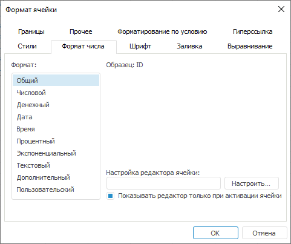

# Атрибуты ячеек листа

Атрибуты ячеек листа
-

# Атрибуты ячеек листа

К атрибутам ячейки относятся:

	- шрифт и цвет текста, выводимого в ячейку;

	- заливка ячейки;

	- выравнивание текста и его перенос;

	- граница ячейки;

	- формат числа;

	- наличие в ячейке гиперссылки и т.д.

Для изменения атрибутов выделите ячейку или область ячеек (диапазон)
 и выполните одно из действий:

	- выполните соответствующую команду в группе «Шрифт»
	 или «Число» на вкладке «Главная» ленты инструментов;

	- выполните команду «Формат >
	 Формат ячеек», расположенную в группе 
	 «Ячейки» на вкладке «Главная» ленты инструментов;

	- выполните команду контекстного меню «Формат
	 ячеек» ячеек;

	- нажмите сочетание клавиш CTRL+1.

После выполнения одного из действий будет открыт диалог «[Формат
 ячейки](UiNav.chm::/GUI/Format.htm)»:

См. также:

[Начало
 работы с инструментом «Отчёты» в веб-приложении](../../../Web/organizational_management/Starting.htm) | [Оформление
 ячеек](../Work/UiReport_Table_WorkStyle.htm)

		Справочная
		 система на версию 10.9
		 от 18/08/2025,
		 © ООО «ФОРСАЙТ»,
