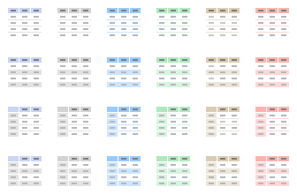
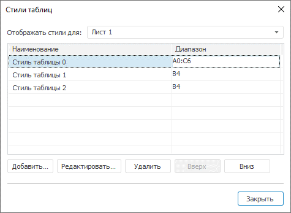

# Оформление ячеек в виде таблицы

Оформление ячеек в виде таблицы
-

# Оформление ячеек в виде таблицы

Произвольный диапазон ячеек листа можно оформить в виде чередующегося
 стиля таблицы. Оформление ячеек с использованием стилей таблицы производится
 при помощи кнопки Стиль
 таблицы», расположенной в группе «Стиль
 таблицы» на вкладке «Главная»
 ленты инструментов.

Примечание.
 В регламентных отчетах существует две схожие настройки: стиль таблицы
 ([табличного визуализатора](../../AreaData/DataTable.htm))
 и оформление ячеек листа в виде таблицы с чередующимися стилями.

## Применение стиля

Для применения стиля выберите один из стандартных стилей или создайте
 новый. При нажатии на кнопку «Стиль таблицы» будут отображены
 стандартные стили:

## Создание стиля

Для создания стиля используйте пункт «Создать
 стиль таблицы» кнопки «Стиль таблицы», будет открыт диалог
 «[Свойства
 чередующегося стиля таблицы](UiAnalyticalArea.chm::/TableView/Formatting/Custom_styles.htm)».
 Задайте необходимые настройки пользовательского стиля.

Наименование стиля будет использовано для идентификации стиля в окне
 «Стили таблиц».

## Редактирование стиля

Для редактирования пользовательского стиля используйте пункт «Редактировать стили таблицы» кнопки
 «Стиль
 таблицы», будет открыт диалог «Стили
 таблиц»:

При нажатии кнопки «Редактировать»
 будет открыт диалог «[Свойства чередующегося стиля таблицы](UiAnalyticalArea.chm::/TableView/Formatting/Custom_styles.htm)».
 Измените в нём настройки стиля.

## Удаление стиля

Для быстрого удаления стиля используйте пункт «Удалить»
 кнопки «Стиль
 таблицы», будет предложено два варианта:

	- Удалить стиль с выделенной
	 таблицы;

	- Удалить все стили с листа.

См. также:

[Начало
 работы с инструментом «Отчёты» в веб-приложении](../../../Web/organizational_management/Starting.htm) | [Оформление
 ячеек](../Work/UiReport_Table_WorkStyle.htm)

		Справочная
		 система на версию 10.9
		 от 18/08/2025,
		 © ООО «ФОРСАЙТ»,
