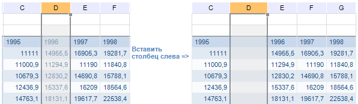
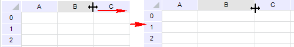
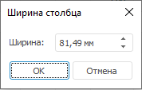
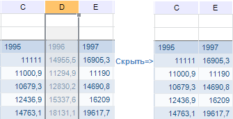
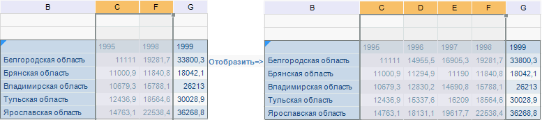

# Операции со столбцами: Регламентный отчёт, настольное приложение

Операции со столбцами: Регламентный отчёт, настольное приложение
-

# Операции со столбцами

Инструмент «Отчёты» позволяет
 выполнять следующие операции со столбцами:

[Добавление
 столбцов](javascript:TextPopup(this))

	Существует два варианта добавления столбцов:

		- Добавление слева.
		 Новый столбец будет добавлен слева от текущего. Ширина добавляемого
		 столбца будет совпадать с шириной столбца, расположенного слева
		 от текущего;

		- Добавление справа.
		 Новый столбец будет добавлен справа от текущего. Ширина добавляемого
		 столбца будет совпадать с шириной текущего столбца.

	Для добавления нового столбца выделите существующий столбец (или
	 любую ячейку, содержащуюся в столбце) и выполните одно из действий:

		- выполните команду контекстного меню «Вставить
		 столбец слева» или «Вставить
		 столбец справа» заголовка столбца;

		- выполните команду контекстного меню «Вставить
		 > Вставить столбец слева» или «Вставить
		 > Вставить столбец справа» ячейки, содержащейся в столбце;

		- выполните команду «Вставить
		 > Вставить столбец слева» или «Вставить
		 > Вставить столбец справа», расположенную в группе «Ячейка» на вкладке «Главная»
		 ленты инструментов;

		- нажмите сочетание клавиш ALT+T. Будет добавлен столбец слева
		 от выделенной ячейки/столбца.

	Примечание.
	 Если перед добавлением столбца для диапазона была настроена [фильтрация](UiAnalyticalArea.chm::/Working_with_table_data/Filtering.htm#filter_report),
	 она будет применяться и для нового столбца.

	Столбцы, которые после выполнения вставки должны оказаться правее
	 нового столбца, сдвигаются вправо на одну позицию. При вставке столбца
	 слева сдвигаются все столбцы, начиная с выделенного. При вставке столбца
	 справа, выделенный столбец остается на месте, а все столбцы правее
	 него сдвигаются.

	

	Операцию добавления столбцов можно производить сразу с несколькими
	 столбцами. В таком случае количество добавленных столбцов будет совпадать
	 с количеством изначально отмеченных столбцов.

[Изменение
 ширины столбцов](javascript:TextPopup(this))

	Изменение ширины столбцов можно производить тремя способами:

		- Ручное изменение ширины.
		 Для ручного изменения ширины столбца подведите указатель мыши
		 к правой границе столбца в области заголовка и перетащите границу
		 на требуемое расстояние, удерживая зажатой кнопку мыши. В области,
		 где возможно перетаскивание, указатель принимает вид двунаправленной
		 стрелки:

	

		- Точное изменение ширины.
		 Для точного задания значения ширины столбца отметьте его (или
		 любую ячейку, содержащуюся в столбце) и выполните команду «Формат > Ширина столбца»,
		 расположенную в группе «Ячейки»
		 на вкладке «Главная» ленты
		 инструментов. После выполнения команды появится одноименное окно:

	

	В появившемся окне введите (измените)
	 значение, которое будет установлено для всех столбцов, пересекающих
	 выделенный в данный момент диапазон. Аналогичную операцию можно выполнить,
	 используя команду контекстного меню «Ширина
	 столбца» наименования столбца/столбцов;

	Примечание.
	 Доступен ввод значения [в разных системах
	 измерения](UiNav.chm::/GUI/Format/Different_units.htm). В поле ввода редактора отображаются
	 значения в единицах измерения, соответствующих текущим региональным
	 настройкам операционной системы.

		- Автоматический подбор ширины.
		 Кроме изменения вручную можно воспользоваться функцией автоматического
		 подгона ширины столбца под оптимальный размер для содержимого
		 ячеек. Для этого выделите столбец (группу столбцов) и выполните
		 команду «Формат > Автоподбор
		 ширины столбца», расположенную в группе «Ячейки»
		 на вкладке «Главная» ленты
		 инструментов. После выполнения команды ширина столбца устанавливается
		 минимально требуемой для отображения самой длинной строки текста
		 столбца. Это условие выполняется и в случае, если была выделена
		 одна ячейка. При изменении ширины столбцов данным способом имеются
		 следующие особенности:

		-

			- при автоматическом подборе ширины игнорируются ячейки,
			 в которых настроен [перенос
			 текста](uinav.chm::/GUI/format/uireport_table_attribute_arrange.htm), так как такие ячейки способны сами
			 подстраиваться фактически под любую ширину столбца;

			- при автоматическом подборе ширины объединенных ячеек
			 сначала подгоняются необъединенные ячейки, расположенные в
			 столбцах, входящих в диапазон объединения, затем объединенные.

	Существует еще один способ быстрого подгона ширины столбца - это
	 двойной щелчок по двунаправленной стрелке. Указатель мыши принимает
	 данный вид при наведении его к границе заголовка столбца.

	Каждый из вышеперечисленных способов может быть применен как к одному
	 столбцу, так и к группе столбцов.

[Скрытие
 столбцов](javascript:TextPopup(this))

	Скрытие столбцов применяется, когда в столбцах содержатся промежуточные
	 вычисления. Данные, содержащиеся в скрытых столбцах, не будут отображаться
	 на экране и при печати.

	Для скрытия столбца отметьте столбец (или любую ячейку, содержащуюся
	 в столбце) и выполните одно из действий:

		- выполните команду контекстного меню «Скрыть»
		 заголовка столбца;

		- выполните команду «Формат
		 > Скрыть или отобразить > Скрыть столбцы», расположенную
		 в группе «Ячейки» вкладки
		 «Главная» ленты инструментов.

	После выполнения одной из команд отмеченный столбец будет скрыт.
	 Столбец, расположенный правее, займет его место:

	

	Операцию скрытия можно производить сразу с несколькими столбцами.

[Отображение
 скрытых столбцов](javascript:TextPopup(this))

	Для отображения скрытого столбца выделите два столбца: столбец левее
	 и правее скрытого, а затем:

		- выполните команду контекстного меню «Отобразить» заголовка
		 отмеченных столбцов;

		- выполните команду «Формат
		 > Скрыть или отобразить > Отобразить столбцы», расположенную
		 в группе «Ячейки» на вкладке
		 «Главная» ленты инструментов.

	После выполнения команды отобразятся скрытые столбцы, находящиеся
	 между отмеченными столбцами:

	

	Если между отмеченными столбцами находятся несколько скрытых столбцов,
	 то после выполнения команды «Отобразить»
	 будут отображены все скрытые столбцы.

	Если необходимо отобразить все скрытые столбцы на листе, то перед
	 выполнением команды [выделите](UiNav.chm::/GUI/Cells_Select.htm#select_list)
	 весь лист.

	Примечание.
	 Задание нулевой ширины столбца и его скрытие - это разные операции.

[Удаление
 столбцов](javascript:TextPopup(this))

	Для удаления столбца выделите существующий столбец (или любую ячейку,
	 содержащуюся в столбце) и выполните одно из действий:

		- выполните команду контекстного меню «Удалить
		 > Удалить столбцы» заголовка столбца;

		- выполните команду контекстного меню «Удалить
		 > Удалить столбцы» ячейки, содержащейся в столбце;

		- выполните команду «Удалить
		 > Удалить столбцы», расположенную в группе «Ячейки»
		 на вкладке «Главная» ленты
		 инструментов.

	Столбец будет удален даже в том случае, когда отмечена всего одна
	 ячейка столбца. После выполнения команды отмеченный столбец будет
	 удален, а все столбцы, расположенные правее, сдвинутся на одну позицию
	 влево.

	Операцию удаления можно производить сразу с несколькими столбцами.
	 Для этого перед выполнением операции [выделите](UiNav.chm::/GUI/Cells_Select.htm#select_list)
	 диапазон, включающий в себя хотя бы по одной ячейке каждого из удаляемых
	 столбцов.

	Механизм замены переменных в формулах следующий:

		- при удалении столбца все значения, которые в своем названии
		 содержат наименование этого столбца, заменяются в формуле на «#ССЫЛКА!». Значения ячеек, формулы
		 которых содержат ссылки на удаленный столбец, изменяются на «#ССЫЛКА!»;

		- все значения, которые в своем названии содержат букву, находящуюся
		 ближе к началу алфавита, чем буква удаленного столбца, остаются
		 без изменений;

		- все значения, которые в своем названии содержат букву, находящуюся
		 ближе к концу алфавита, чем буква удаленного столбца, сдвигаются
		 на одну букву ближе к началу алфавита (F1
		 заменяется на E1, а E1 на D1
		 и т.д.).

	При удалении столбцов на листе проверьте, не входят ли в удаляемый
	 диапазон области данных. При вхождении одной и более областей данных
	 в удаляемый диапазон выдается сообщение о подтверждении операции.
	 При подтверждении области данных будут удалены как с листа, так и
	 из отчета. Удаленные таким образом области данных не отображаются
	 на панели «[Источники
	 и срезы данных](../../Source/UiReport_Source.htm)».

[Закрепление
 первого столбца](javascript:TextPopup(this))

	Фиксация первого столбца листа используется для того, чтобы при
	 прокрутке данных фиксированная область всегда отображалась на экране.

	Для фиксации первого столбца выполните команду «Закрепить
	 области», расположенную в группе «Окно»
	 на вкладке «Вид» ленты инструментов,
	 и выберите вариант закрепления области «Закрепить
	 первый столбец».

[Снятие закрепления
 областей](javascript:TextPopup(this))

	Для отключения закрепления области выполните команду «Закрепить
	 области», расположенную в группе «Окно»
	 на вкладке «Вид» ленты инструментов,
	 и выберите вариант «Снять закрепление
	 областей».

См. также:

[Начало
 работы с инструментом «Отчёты» в веб-приложении](../../../Web/organizational_management/Starting.htm) | [Работа
 с элементами листа отчёта](../UiReport_Table.htm)

		Справочная
		 система на версию 10.9
		 от 18/08/2025,
		 © ООО «ФОРСАЙТ»,
