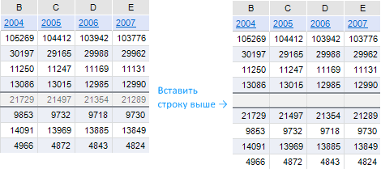
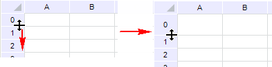
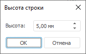

# Операции со строками: Регламентный отчёт, настольное приложение

Операции со строками: Регламентный отчёт, настольное приложение
-

# Операции со строками

Инструмент «Отчёты» позволяет
 выполнять следующие операции над строками:

[Добавление
 строк](javascript:TextPopup(this))

	Существует два варианта добавления строк:

		- Добавление снизу.
		 Новая строка будет добавлена под текущей. Высота добавляемой строки
		 будет совпадать с высотой текущей строки;

		- Добавление сверху.
		 Новая строка будет добавлена над текущей. Высота добавляемой строки
		 будет совпадать с высотой строки, расположенной выше текущей.

	Для добавления новой строки отметьте существующую строку (или любую
	 ячейку, содержащуюся в строке) и выполните одно из действий:

		- выполните команду контекстного меню «Вставить
		 строку выше» или «Вставить
		 строку ниже» заголовка строки;

		- выполните команду контекстного меню «Вставить
		 > Вставить строку выше» или «Вставить
		 > Вставить строку ниже» ячейки, содержащейся в строке;

		- выполните команду «Вставить
		 > Вставить строку выше» или «Вставить
		 > Вставить строку ниже», расположенную в группе «Ячейка» на вкладке «Главная»
		 ленты инструментов;

		- нажмите сочетание клавиш ALT+Y. Будет добавлена строка выше
		 выделенной ячейки/строки.

	Примечание.
	 Если перед добавлением строки для диапазона была настроена [фильтрация](UiAnalyticalArea.chm::/Working_with_table_data/Filtering.htm#filter_report),
	 она будет применяться и для новой строки.

	После выполнения команды новая строка добавится в указанное положение,
	 а существующая сдвинется в противоположном направлении:

	

	Операцию добавления строк можно производить сразу с несколькими
	 строками. В таком случае количество добавленных строк будет совпадать
	 с количеством изначально отмеченных строк.

[Изменение
 высоты строк](javascript:TextPopup(this))

	Изменение высоты строк можно производить несколькими способами:

		- Ручное изменение высоты.
		 Для ручного изменения высоты строки подведите указатель мыши к
		 нижней границе строки в области заголовка, вблизи которой указатель
		 примет вид двунаправленной стрелки (указывающей на возможность
		 соответствующего перемещения), нажмите кнопку мыши и, удерживая
		 ее, передвиньте границу на требуемое расстояние:

	

		- Точное изменение высоты.
		 Для точного задания высоты строки отметьте ее (или любую ячейку,
		 находящуюся в строке) и выполните команду «Формат
		 > Высота строки», расположенную в группе «Ячейки»
		 на вкладке «Главная» ленты
		 инструментов. После выполнения команды появится одноименное окно:

	

	В появившемся окне введите (измените)
	 значение, которое будет установлено для текущей строки или выделенных
	 строк. Аналогичную операцию можно выполнить, используя команду контекстного
	 меню «Высота строки» наименования
	 строки/строк.

	Примечание.
	 Доступен ввод значения [в разных системах
	 измерения](UiNav.chm::/GUI/Format/Different_units.htm). В поле ввода редактора отображаются
	 значения в единицах измерения, соответствующих текущим региональным
	 настройкам операционной системы.

		- Автоматический подбор высоты.
		 Кроме изменения вручную, можно воспользоваться функцией автоматического
		 подбора высоты строки в зависимости от содержимого ячеек. Для
		 этого отметьте строку (группу строк) и выполните команду «Формат > Автоподбор высоты строки»,
		 расположенную в группе «Ячейки»
		 на вкладке «Главная» ленты
		 инструментов. После выполнения команды высота строки устанавливается
		 минимально требуемой для отображения самой высокой строки текста.
		 При изменении высоты строк данным способом имеются следующие особенности:

			- при автоматическом подборе высоты игнорируются ячейки,
			 в которых настроен [перенос
			 текста](uinav.chm::/GUI/format/uireport_table_attribute_arrange.htm), так как такие ячейки способны сами
			 подстраиваться фактически под любую высоту строки;

			- при автоматическом подборе высоты объединенной ячейки
			 сначала подгоняются необъединенные ячейки, расположенные в
			 строках, входящих в диапазон объединения, затем объединенная.

		- Быстрая подгонка высоты
		 строки. Для быстрой подгонки высоты строки наведите на
		 границу строк указатель мыши, чтобы он принял вид двунаправленной
		 стрелки. Затем дважды щелкните по границе строк в области заголовка
		 строк.

	Примечание.
	 При изменении высоты строк учитывайте следующие особенности переноса
	 текста в ячейках:

	     • если для ячеек какой-либо строки не
	 изменялась высота вручную, то при установке [переключателя](uinav.chm::/GUI/format/uireport_table_attribute_arrange.htm)
	 «Текст по словам» или «Слова по слогам» для данных ячеек
	 будет осуществлен автоматический подбор высоты;

	     • для китайского языка перенос текста
	 осуществляется по иероглифам.

	Каждый из вышеперечисленных способов может быть применен как к одной
	 строке, так и к группе строк.

[Скрытие
 строк](javascript:TextPopup(this))

	Скрытие строк применяется, когда в строках содержатся промежуточные
	 вычисления. Данные, содержащиеся в скрытых строках, не будут отображаться
	 на экране и при печати.

	Для скрытия строки отметьте строку (или любую ячейку, содержащуюся
	 в строке) и выполните одно из действий:

		- выполните команду контекстного меню «Скрыть»
		 заголовка строки;

		- выполните команду «Формат
		 > Скрыть или отобразить > Скрыть строки», расположенную
		 в группе «Ячейки» вкладки
		 «Главная» ленты инструментов.

	После выполнения команды отмеченная строка будет скрыта. Строка,
	 расположенная ниже, займет ее место.

	Операцию скрытия можно производить сразу с несколькими строками.

[Отображение
 скрытых строк](javascript:TextPopup(this))

	Для отображения скрытой строки выделите две строки: выше и ниже
	 скрытой, затем:

		- выполните команду контекстного меню «Отобразить» заголовка
		 отмеченных строк;

		- выполните команду «Формат
		 > Скрыть или отобразить > Отобразить строки», расположенную
		 в группе «Ячейки» на вкладке
		 «Главная» ленты инструментов.

	После выполнения команды отобразится скрытая строка, находящаяся
	 между отмеченными строками.

	Если между отмеченными строками находятся несколько скрытых строк,
	 то после выполнения команды «Отобразить»
	 будут отображены все скрытые строки.

	Для отображения всех скрытых строк на листе отметьте все строки
	 листа и выполните команду контекстного меню области заголовков строк
	 «Отобразить».

[Удаление
 строк](javascript:TextPopup(this))

	Для удаления строки отметьте строку (или любую ячейку, содержащуюся
	 в строке) и выполните одно из действий:

		- выполните команду контекстного меню «Удалить
		 > Удалить строки» заголовка строки;

		- выполните команду контекстного меню «Удалить
		 > Удалить строки» ячейки, содержащейся в строке;

		- выполните команду «Удалить
		 > Удалить строки», расположенную в группе «Ячейки»
		 на вкладке «Главная» ленты
		 инструментов.

	Строка будет удалена даже в том случае, когда отмечена всего одна
	 ячейка строки. После выполнения команды отмеченная строка будет удалена.
	 При этом строка, расположенная ниже, займет ее место.

	Операцию удаления можно производить сразу с несколькими строками.
	 Для этого перед выполнением операции выделите диапазон, включающий
	 в себя хотя бы по одной ячейке каждой удаляемой строки.

	Механизм замены переменных в формулах следующий:

		- при удалении строки все значения, которые в своем названии
		 содержат номер этой строки, заменяются в формуле на «#ССЫЛКА!».
		 Значение ячеек, формулы которых содержат ссылки на удаленную строку,
		 изменяется на «#ССЫЛКА!»;

		- все значения, которые в своем названии содержат номер, меньший
		 порядкового номера удаленной строки, остаются без изменений;

		- все значения, которые в своем названии содержат номер, больший
		 порядкового номера удаленной строки, уменьшаются на единицу (A10 заменяется на A9,
		 B10 на B9
		 и т.д).

	При удалении строк производится корректировка формул, содержащих
	 удаленные (перемещенные в результате добавления) ячейки, находящиеся
	 на других листах регламентного отчета.

	При удалении строк на листе проверьте, не входят ли в удаляемый
	 диапазон области данных. При вхождении одной и более областей данных
	 в удаляемый диапазон выдается сообщение о подтверждении операции.
	 При подтверждении области данных будут удалены как с листа, так и
	 из отчета. Удаленные таким образом области данных не отображаются
	 на панели «[Источники
	 и срезы данных](../../Source/UiReport_Source.htm)».

[Закрепление
 первой строки](javascript:TextPopup(this))

	Фиксации первой строки листа используется для того, чтобы при прокрутке
	 данных фиксированная область всегда отображалась на экране.

	Для фиксации первой строки выполните команду «Закрепить
	 области», расположенную в группе «Окно»
	 на вкладке «Вид» ленты инструментов,
	 и выберите вариант закрепления области «Закрепить
	 первый столбец».

[Снятие
 закрепления областей](javascript:TextPopup(this))

	Для отключения закрепления области выполните команду «Закрепить
	 области», расположенную в группе «Окно»
	 на вкладке «Вид» ленты инструментов,
	 и выберите вариант «Снять закрепление
	 областей».

См. также:

[Начало
 работы с инструментом «Отчёты» в веб-приложении](../../../Web/organizational_management/Starting.htm) | [Работа
 с элементами листа отчёта](../UiReport_Table.htm)

		Справочная
		 система на версию 10.9
		 от 18/08/2025,
		 © ООО «ФОРСАЙТ»,
