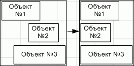
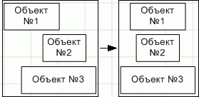
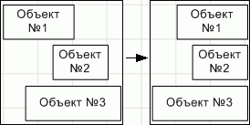
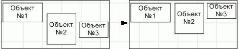
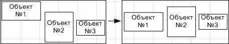
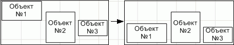
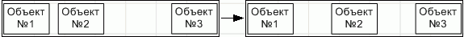
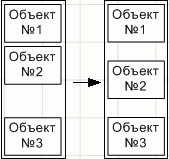

# Выравнивание объектов в группе: Регламентный отчёт, настольное приложение

Выравнивание объектов в группе: Регламентный отчёт, настольное приложение
-

# Выравнивание объектов в группе

Если на листе отчета [выбрано](../../Objects/UiReport_Objects_Operation.htm#choose_object)
 два и более объекта, то для них доступны операции выравнивания и распределения
 относительно друг друга, подбора размеров.

## Выравнивание/распределение объектов

Для выравнивания/распределения объектов, расположенных на листе отчета,
 выполните одно из действий:

	- нажмите кнопку «Выровнять»,
	 расположенную в группе «Упорядочить»
	 на вкладке «Объект. Формат»
	 ленты инструментов;

	- выполните команду контекстного меню «Выровнять/Распределить».

После выполнения действия выберите вариант выравнивания объектов:

[Выровнять по
 левому краю](javascript:TextPopup(this))

	Выделенные объекты будут выровнены по левому краю относительно крайнего
	 левого объекта:

	

[Выровнять по
 центру](javascript:TextPopup(this))

	Выделенные объекты будут выровнены по центру. Центр рассчитывается
	 исходя из положения крайнего левого объекта и крайнего правого среди
	 выделенных и размеров самих объектов:

	

[Выровнять по
 правому краю](javascript:TextPopup(this))

	Выделенные объекты будут выровнены по правому краю относительно
	 крайнего правого объекта:

	

[Выровнять по
 верхнему краю](javascript:TextPopup(this))

	Выделенные объекты будут выровнены по верхнему краю относительно
	 крайнего верхнего объекта:

	

[Выровнять по
 середине](javascript:TextPopup(this))

	Выделенные объекты будут выровнены по середине. Середина рассчитывается
	 исходя из положения крайнего верхнего объекта и крайнего нижнего среди
	 выделенных и размеров самих объектов:

	

[Выровнять по
 нижнему краю](javascript:TextPopup(this))

	Выделенные объекты будут выровнены по нижнему краю относительно
	 крайнего нижнего объекта:

	

[Распределить
 по горизонтали](javascript:TextPopup(this))

	Выделенные объекты будут отстоять друг от друга по горизонтали на
	 одинаковом расстоянии. Расстояние рассчитывается исходя из положения
	 крайнего левого и крайнего правого объекта среди выделенных и размеров
	 самих объектов:

	

[Распределить
 по вертикали](javascript:TextPopup(this))

	Выделенные объекты будут отстоять друг от друга по вертикали на
	 одинаковом расстоянии. Расстояние рассчитывается исходя из положения
	 крайнего верхнего и крайнего нижнего объекта среди выделенных и размеров
	 самих объектов:

	

## Выравнивание объектов по размерам

Для выравнивания по размерам объектов, расположенных на листе отчета,
 выполните команду контекстного меню «Размер»
 и выберите вариант выравнивания:

[Подобрать по
 минимальной ширине](javascript:TextPopup(this))

	Ширина всех выделенных объектов будет изменена на ширину самого
	 узкого объекта в группе:

	

[Подобрать по
 максимальной ширине](javascript:TextPopup(this))

	Ширина всех выделенных объектов будет изменена на ширину самого
	 широкого объекта в группе:

	

[Подобрать по
 минимальной высоте](javascript:TextPopup(this))

	Высота всех выделенных объектов будет изменена на высоту самого
	 низкого объекта в группе:

	

[Подобрать по
 максимальной высоте](javascript:TextPopup(this))

	Высота всех выделенных объектов будет изменена на высоту самого
	 высокого объекта в группе:

	

См. также:

[Начало
 работы с инструментом «Отчёты» в веб-приложении](../../../Web/organizational_management/Starting.htm) | [Вставка
 иллюстраций, фигур и текстовых блоков](../../Objects/UiReport_Objects.htm) | [Построение
 отчёта](../../CreateReport.htm) | [Работа
 с готовым отчётом](../../Reports/OperationReport/Work_witn_report.htm)

		Справочная
		 система на версию 10.9
		 от 18/08/2025,
		 © ООО «ФОРСАЙТ»,
