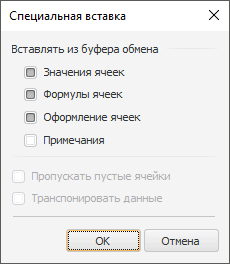

# Специальная вставка: Регламентный отчёт, настольное приложение

Специальная вставка: Регламентный отчёт, настольное приложение
-

# Специальная вставка

При вставке данных из буфера обмена существует возможность корректировки
 вставляемых данных. Для этого выполните команду «Специальная
 вставка»:

	- в контекстном меню ячейки;

	- в раскрывающемся меню кнопки «Вставить»,
	 расположенной на вкладке «Главная»
	 ленты инструментов.

Будет открыто окно «Специальная
 вставка»:

Задайте в окне следующие параметры:

	- Вставлять из буфера обмена.
	 Определите параметры специальной вставки:

	-

		- Значения ячеек.
		 По умолчанию флажок установлен и вставляются значения ячеек. При
		 снятии флажка значения ячеек вставляться не будут;

		- Формулы ячеек. По
		 умолчанию флажок установлен и вставляются формулы, содержащиеся
		 в ячейках. При снятии флажка формулы, содержащиеся в ячейках,
		 вставляться не будут;

		- Оформление ячеек.
		 По умолчанию флажок установлен и вставляется оформление ячеек.
		 При снятии флажка оформление ячеек вставляться не будет;

		- Примечания. По умолчанию
		 флажок снят и примечания не вставляются. При установке флажка
		 примечания ячеек будут вставляться;

	- Пропускать пустые ячейки.
	 Если вставляемые данные содержат пустые значения, то при установке
	 данного флажка они вставляться не будут. То есть в ячейках, в которые
	 должны были вставляться пустые значения, останутся старые данные;

	- Транспонировать данные.
	 При установке флажка вставляемые данные будут транспонированы, то
	 есть столбцы будут представлены в строках, а строки в столбцах.

Примечание.
 Существуют особенности при вставке на лист регламентного отчета данных
 из буфера обмена, имеющих [собственное
 оформление](UiReport_Table_Insert_not_formatted.htm).

См. также:

[Начало
 работы с инструментом «Отчёты» в веб-приложении](../../../Web/organizational_management/Starting.htm) | [Копирование
 и вставка данных](UiReport_Table_Work_insert.htm)

		Справочная
		 система на версию 10.9
		 от 18/08/2025,
		 © ООО «ФОРСАЙТ»,
