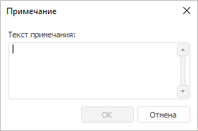

# Добавление примечания: Регламентный отчёт, настольное приложение

Добавление примечания: Регламентный отчёт, настольное приложение
-

# Добавление примечания

Примечания, добавляемые к ячейкам на листе отчёта, могут быть многострочными.
 Ячейка, у которой есть примечание, отмечена красным треугольником в верхнем
 правом углу. Для просмотра примечания наведите указатель мыши на ячейку.

Для добавления примечания к выделенной ячейке:

	- выполните команду «Вставить
	 > Добавить примечание», расположенную в группе «Ячейка»
	 на вкладке «Главная» ленты
	 инструментов;

	- выполните команду «Добавить
	 примечание» в контекстном меню ячейки;

	- нажмите сочетание клавиш CTRL+ALT+H.

Будет открыто окно для ввода текста примечания:

## Работа с примечаниями

При работе с примечаниями доступны следующие операции:

[Редактирование
 примечания](javascript:TextPopup(this))

	Для редактирования примечания к выбранной ячейку:

		- выполните команду «Изменить
		 примечание» в контекстном меню ячейки;

		- выполните команду «Вставить>
		 Изменить примечание», расположенную в группе «Редактирование»
		 на вкладке «Главная» ленты
		 инструментов.

	Будет открыто окно для ввода/редактирования текста примечания.

[Удаление примечание](javascript:TextPopup(this))

	Для удаления примечания к выделенной ячейке:

		- выполните команду «Удалить
		 примечание» в контекстном меню ячейки;

		- выполните команду «Очистить
		 > Очистить примечания», расположенную в группе «Редактирование» на вкладке «Главная» ленты инструментов.

	Примечание к ячейке будет удалено.

См. также:

[Начало
 работы с инструментом «Отчёты» в веб-приложении](../../../Web/organizational_management/Starting.htm) | [Работа
 с данными на листе отчёта](../DataReport.htm)

		Справочная
		 система на версию 10.9
		 от 18/08/2025,
		 © ООО «ФОРСАЙТ»,
