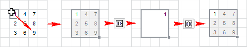
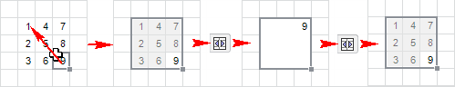

# Операции с ячейками: Регламентный отчёт, настольное приложение

Операции с ячейками: Регламентный отчёт, настольное приложение
-

# Операции с ячейками

При работе с листом регламентного отчета доступны различные операции
 с ячейками.

## Добавление ячеек

Для добавления ячейки в диапазон:

	- выполните команду контекстного меню «Вставить
	 > Сдвинуть ячейки вниз» или «Вставить
	 > Сдвинуть ячейки вправо» ячейки;

	- выполните команду «Вставить
	 > Сдвинуть ячейки вниз» или «Вставить
	 > Сдвинуть ячейки вправо», расположенную в группе «Ячейки» на вкладке «Главная»
	 ленты инструментов.

После выполнения одного из действий на лист будет добавлена ячейка.
 При этом ячейки, расположенные ниже/правее сдвинутся вниз/вправо. Если
 был выделен диапазон ячеек, то будет добавлено столько же ячеек, сколько
 в выделенном диапазоне.

Для быстрого добавления ячейки выше выделенной выполните команду «Вставить», расположенную в группе
 «Ячейки» на вкладке «Главная»
 ленты инструментов.

## Удаление ячеек

Для удаления выделенных ячеек из диапазона:

	- выполните команду контекстного меню «Удалить
	 > Сдвинуть ячейки вверх» или «Удалить
	 > Сдвинуть ячейки влево» ячейки;

	- выполните команду «Удалить
	 > Сдвинуть ячейки вверх» или «Удалить
	 > Сдвинуть ячейки влево», расположенную в группе «Ячейки» на вкладке «Главная»
	 ленты инструментов.

После выполнения одного из действий выделенный диапазон ячеек будет
 удален. При этом ячейки, расположенные ниже/правее диапазона сдвинутся
 вверх/влево.

Для быстрого удаления ячейки или выделенного диапазона ячеек выполните
 команду «Удалить», расположенную
 в группе «Ячейки» на вкладке «Главная» ленты инструментов. После
 выполнения данной команды произойдет сдвиг ячеек вверх.

## Объединение и разъединение ячеек

Несколько подряд выделенных ячеек можно объединить в одну. После объединения
 такая ячейка получает адрес ячейки, которая расположена в верхнем левом
 углу объединяемого диапазона.

Для объединения ячеек отметьте диапазон ячеек и нажмите кнопку  «Объединить
 ячейки», расположенную в группе «Выравнивание»
 вкладки «Главная» ленты инструментов.

Для разъединения объединенных ячеек отметьте объединенную ячейку и повторно
 нажмите кнопку «Объединить ячейки»:

Объединенная ячейка будет содержать те данные, которые содержала первая
 ячейка выделяемого диапазона. После объединения данные остальных ячеек
 не пропадают, а просто скрываются. Таким образом, после разъединения данные
 всех ячеек диапазона будут восстановлены.

См. также:

[Начало
 работы с инструментом «Отчёты» в веб-приложении](../../../Web/organizational_management/Starting.htm) | [Работа
 с элементами листа отчёта](../UiReport_Table.htm)

		Справочная
		 система на версию 10.9
		 от 18/08/2025,
		 © ООО «ФОРСАЙТ»,
