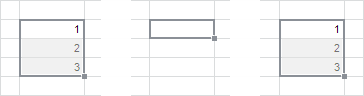
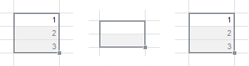

# Копирование и вставка данных

Копирование и вставка данных
-

# Копирование и вставка данных

Для копирования данных отчёта из выделенной ячейки или области:

	- нажмите кнопку  «Копировать»
	 в группе «Буфер обмена» на
	 вкладке «Главная» ленты инструментов;

	- выполните команду контекстного меню  «Копировать» выделенного диапазона
	 ячеек;

	- нажмите сочетание клавиш CTRL+С или CTRL+INSERT.

Для вырезания данных из выделенной ячейки или области для их последующего
 перемещения в другую ячейку или область:

	- нажмите кнопку  «Вырезать»
	 в группе «Буфер обмена» на
	 вкладке «Главная» ленты инструментов;

	- выполните команду контекстного меню  «Вырезать» выделенного диапазона
	 ячеек;

	- нажмите сочетание клавиш CTRL+X или SHIFT+DELETE.

Для вставки данных в выделенную ячейку или область:

	- нажмите кнопку  «Вставить»
	 в группе «Буфер обмена» на
	 вкладке «Главная» ленты инструментов;

	- выполните команду контекстного меню  «Вставить» выделенного диапазона
	 ячеек;

	- нажмите сочетание клавиш CTRL+V или SHIFT+INSERT.

Примечание.
 Для корректировки вставляемых данных воспользуйтесь [специальной
 вставкой](UiReport_Table_Work_Insert_spec.htm).

[Копирование
 и вставка данных из других приложений](javascript:TextPopup(this))

	При вставке данных, скопированных в буфер обмена из внешних приложений,
	 оформление может отличаться от исходного. Правила оформления при вставке
	 скопированных данных описаны в статье «[Параметры
	 форматирования при вставке из буфера обмена](UiReport_Table_Insert_not_formatted.htm)».

	Поддерживается копирование таблиц Microsoft Excel. При копировании
	 таблиц не копируются следующие настройки:

		- ориентация текста;

		- штриховка;

		- рисунки, диаграммы;

		- объекты WordArt и SmartArt;

		- автофигуры;

		- текстовые блоки;

		- гиперссылки;

		- формулы и функции, содержащиеся в ячейках. Копируется только
		 результат вычисления.

	Вставка рисунков, диаграмм, автофигур, текстовых блоков, а также
	 объектов WordArt и SmartArt, скопированных из Microsoft Excel, выполняется
	 в виде [рисунков](../../Objects/Picture/UiReport_Objects_Picture.htm).

## Особенности вырезания данных

Вставка вырезанных данных выполняется с сохранением всех исходных [настроек оформления
 ячеек](../Attribute/UiReport_Table_Styles.htm) и [примечаний](UiReport_Table_Work_Notice.htm) при
 их наличии.

При вырезании данных:

	- в отчёте, открытом в режиме просмотра, очищается только содержимое
	 ячеек;

	- в отчёте, открытом в режиме редактирования:

		- для ячеек [табличного
		 визуализатора](../../AreaData/DataTable.htm) очищается только содержимое ячеек;

		- для остальных ячеек листа очищаются содержимое ячеек, форматы
		 данных в ячейках и примечания к ячейкам.

## Особенности вставки данных

В зависимости от выделенного диапазона ячеек для вставки данных можно
 выделить следующие особенности:

	- Для вставки данных выделяется
	 только одна ячейка. Ячейка для вставки будет расширена вправо
	 и вниз до диапазона, равного размеру скопированной области. На примере
	 изображены копируемые данные (слева), выделенная ячейка (по центру),
	 вставленные данные (справа):

	- Для вставки данных выделяется
	 несколько ячеек. Если копируемая область по размерам меньше,
	 чем область, выделенная для вставки, то произойдет заполнение области
	 для вставки копируемой областью. На примере ниже изображены копируемые
	 данные (слева), выделенная область (по центру), вставленные данные
	 (справа). Копируемая область размещается в области для вставки несколько
	 раз целиком, но могут остаться незаполненные ячейки так как их не
	 достаточно для вставки копируемой области целиком:

Если копируемая область по размерам больше,
 чем область, выделенная для вставки, то копируемая область займет всю
 область для вставки и соседние ячейки, необходимые для полного размещения
 копируемой области.

См. также:

[Начало
 работы с инструментом «Отчёты» в веб-приложении](../../../Web/organizational_management/Starting.htm) | [Специальная вставка](UiReport_Table_Work_Insert_spec.htm)
 | [Параметры форматирования
 при вставке из буфера обмена](UiReport_Table_Insert_not_formatted.htm)

		Справочная
		 система на версию 10.9
		 от 18/08/2025,
		 © ООО «ФОРСАЙТ»,
