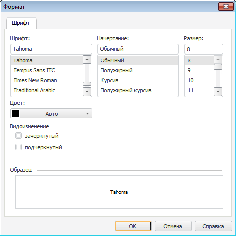

# Параметры шрифта: Регламентный отчёт, настольное приложение

Параметры шрифта: Регламентный отчёт, настольное приложение
-

# Параметры шрифта

Окно «Шрифт» может быть открыто
 при настройке:

	- [колонтитулов отчёта](UiReport_Tuning_ParamPage_3.htm);

	- [заголовка отчёта](UiReport_Tuning_ParamPage_5.htm).

Для настройки шрифта доступны операции:

[Выбор типа шрифта](javascript:TextPopup(this))

	В поле «Шрифт» выберите
	 тип шрифта.

[Выбор начертания
 шрифта](javascript:TextPopup(this))

	В поле «Начертание» выберите
	 стиль начертания шрифта:

		- обычный;

		- полужирный;

		- курсив;

		- полужирный
		 курсив.

[Выбор размера
 шрифта](javascript:TextPopup(this))

	В поле «Размер» выберите
	 размер шрифта.

[Выбор цвета
 шрифта](javascript:TextPopup(this))

	В раскрывающейся палитре «Цвет»
	 выберите цвет текста. Для выбора нового цвета в расширенной палитре
	 цветов нажмите кнопку «Другой».

[Настройка видоизменения
 шрифта](javascript:TextPopup(this))

	В поле «Видоизменение» выберите
	 вид шрифта, установив необходимые флажки:

		- зачёркнутый;

		- подчёркнутый.

[Просмотр образца
 текста](javascript:TextPopup(this))

	В области «Образец» отображается
	 внешний вид текста, который он примет после применения установленных
	 параметров. Проверьте, соответствует ли внешний вид текста ожидаемому
	 результату.

См. также:

[Начало
 работы с инструментом «Отчёты» в веб-приложении](../../../Web/organizational_management/Starting.htm) | [Колонтитулы
 на странице](UiReport_Tuning_ParamPage_3.htm) | [Настройка
 отчёта под печать](UiReport_Tuning_ParamPage.htm) | [Построение
 отчёта](../../CreateReport.htm) | [Работа
 с готовым отчётом](../../Reports/OperationReport/Work_witn_report.htm)

		Справочная
		 система на версию 10.9
		 от 18/08/2025,
		 © ООО «ФОРСАЙТ»,
