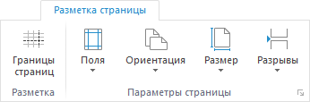
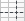

# Настройка отчёта под печать: Регламентный отчёт, настольное приложение

Настройка отчёта под печать: Регламентный отчёт, настольное приложение
-

# Настройка отчёта под печать

Для настройки отчёта под печать:

	- Выберите лист отчёта. Параметры страницы настраиваются при открытии
	 регламентного отчёта на [редактирование](../../organizational_management/Starting.htm#open)
	 для каждого листа отдельно, кроме параметров [заголовка
	 отчёта](UiReport_Tuning_ParamPage_5.htm).

	- Выполните [быструю](UiReport_Tuning_ParamPage.htm#quick)
	 или [расширенную](UiReport_Tuning_ParamPage.htm#parampage)
	 настройку параметров страницы.

После выполнения действий отчёт будет готов для [печати](../../Reports/OperationReport/UiReport_Reports_Operation_Print.htm).

Примечание.
 В регламентном отчёте и [форме
 ввода](DataEntryForms.chm::/DataEntryForms_Purpose.htm) используются одинаковые команды и диалоги для
 настройки отчёта под печать.

## Быстрая настройка

Для выполнения быстрой настройки параметров страницы активного листа
 отчёта откройте вкладку «Разметка страницы»
 ленты инструментов:

Для быстрой настройки доступны:

	- Границы страниц. Нажмите
	 кнопку 
	 «Границы страниц» для просмотра
	 границ страниц листа, выводимых при печати и/или экспорте. После выполнения
	 действия на активном листе отчёта будут отображены разрывы страниц
	 в виде пунктирной линии. Границы страницы устанавливаются в зависимости
	 от ориентации, ширины полей, размеров страницы и разрывов;

	- Поля. Нажмите кнопку
	 
	 «Поля» для выбора варианта
	 ширины полей в раскрывающемся меню кнопки:

		- обычные;

		- широкие;

		- узкие.

Для расширенной настройки полей выполните
 команду «Настроить поля» в раскрывающемся
 меню кнопки. После выполнения действия будет открыто окно «Параметры страницы» на вкладке «[Поля](UiReport_Tuning_ParamPage_2.htm)»;

	- Ориентация. Нажмите
	 кнопку 
	 «Ориентация» для изменения
	 варианта ориентации страницы в раскрывающемся меню кнопки:

		- книжная;

		- альбомная;

	- Размер. Нажмите кнопку  «Размер»
	 для выбора размера страницы в раскрывающемся меню кнопки. Список содержит
	 предустановленные варианты размеров бумаги, такие как А4, А5 и другие;

	- Разрывы. Выделите ячейку,
	 которая будет являться левой верхней ячейкой новой границы страницы,
	 и выполните команду «Вставить разрыв»
	 в раскрывающемся меню кнопки  «Разрывы» для отображения определенных
	 данных листа на одной странице. После выполнения действия будут отображены
	 разрывы страницы в виде сплошной линии и автоматически включено отображение
	 границ страниц.

Для получения подробной информации о настройке
 разрывов страницы обратитесь к разделу «[Настройка
 разрывов страницы](../../Reports/OperationReport/Page_Borders_Breaks.htm)».

## Расширенная настройка

Для выполнения расширенной настройки параметров страницы активного листа
 отчёта откройте окно «Параметры страницы»
 с помощью команды главного меню:

	- «Отчет > Печать > Параметры
	 страницы» в регламентном отчёте;

	- «Форма ввода/вывода > Печать
	 > Параметры
	 страницы» в [форме
	 ввода](DataEntryForms.chm::/DataEntryForms_Purpose.htm).

В результате будет открыто окно «Параметры
 страницы»:

Для настройки печати используйте вкладки окна:

	- Страница.
	 Предназначена для настройки [общих
	 параметров страницы](UiReport_Tuning_ParamPage_1.htm);

	- Поля. Предназначена
	 для настройки [отступов на странице](UiReport_Tuning_ParamPage_2.htm);

	- Колонтитулы. Предназначена
	 для настройки [колонтитулов
	 на странице](UiReport_Tuning_ParamPage_3.htm);

	- Печать. Предназначена
	 для настройки [параметров
	 печати](UiReport_Tuning_ParamPage_4.htm);

	- Заголовок. Предназначена
	 для настройки [заголовка
	 отчёта](UiReport_Tuning_ParamPage_5.htm).

См. также:

[Начало
 работы с инструментом «Отчёты» в веб-приложении](../../../Web/organizational_management/Starting.htm) | [Построение
 отчёта](../../CreateReport.htm)

		Справочная
		 система на версию 10.9
		 от 18/08/2025,
		 © ООО «ФОРСАЙТ»,
