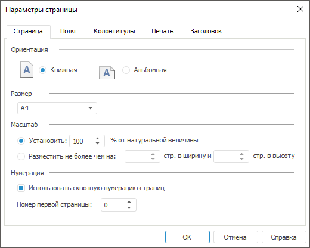

# Общие параметры страницы: Регламентный отчёт, настольное приложение

Общие параметры страницы: Регламентный отчёт, настольное приложение
-

# Общие параметры страницы

Для общих параметров страницы отчёта доступна [быстрая](UiReport_Tuning_ParamPage.htm#quick)
 и расширенная настройка.

Примечание.
 Набор параметров быстрой и расширенной настройки отличается.

Для расширенной настройки общих параметров страницы:

	- Откройте окно «Параметры страницы»
	 с помощью команды главного меню:

		- «Отчет > Печать
		 > Параметры
		 страницы» в регламентном отчёте;

		- «Форма ввода/вывода >
		 Печать > Параметры страницы» в [форме ввода](DataEntryForms.chm::/DataEntryForms_Purpose.htm).

	- Перейдите на вкладку «Страница»:

	- Задайте параметры страницы:

		- Ориентация. Выберите
		 вариант ориентации страницы с помощью переключателей:

			- книжная;

			- альбомная;

		- Размер. Выберите
		 размер страницы в раскрывающемся списке. Раскрывающийся список
		 содержит предустановленные варианты размеров бумаги, такие как
		 А4, А5 и другие;

		- Масштаб. Выберите
		 способ масштабирования страницы с помощью переключателей:

			- Установить.
			 Установите масштаб
			 как процент от натуральной величины;

			- Разместить не более
			 чем на. Укажите в числовых полях ограничение
			 количества страниц по ширине и/или высоте печатной страницы.
			 Если задать значение только в одном из полей, а второе оставить
			 пустым, то ограничение на количество печатаемых листов будет
			 накладываться только на заданное поле;

		- Нумерация. Установите
		 флажок «Использовать сквозную
		 нумерацию страниц» для нумерации страниц листов в сквозном
		 порядке. Для листов, у которых этот флажок снят, используется
		 собственная нумерация страниц. При снятии флажка номера страниц
		 для листов с установленным флажком пересчитываются.

В поле «Номер
 первой страницы» укажите номер, с которого будет начинаться нумерация
 страниц листа. Значение параметра учитывается для каждого листа отчёта
 даже при использовании сквозной нумерации. Для сквозной нумерации страниц
 нескольких листов задайте значение в поле «Номер
 первой страницы» для первого листа отчёта, у которого установлен
 флажок «Использовать сквозную нумерацию
 страниц». У остальных листов с установленным флажком «Использовать
 сквозную нумерацию страниц» в поле «Номер
 первой страницы» задайте значение «0».

Примечание.
 Данный параметр нумерации влияет только на [колонтитулы](UiReport_Tuning_ParamPage_3.htm)
 с тегом «&[Page]». Для колонтитулов с тегами «&[Pages]», «&[Sheet.Page]»
 и «&[Sheet.Pages]» сквозная нумерация не может быть применена.

После выполнения действий будут заданы общие
 параметры страницы для [печати](../../Reports/OperationReport/UiReport_Reports_Operation_Print.htm).

См. также:

[Начало
 работы с инструментом «Отчёты» в веб-приложении](../../../Web/organizational_management/Starting.htm) | [Настройка
 отчёта под печать](UiReport_Tuning_ParamPage.htm) | [Построение
 отчёта](../../CreateReport.htm) | [Работа
 с готовым отчётом](../../Reports/OperationReport/Work_witn_report.htm)

		Справочная
		 система на версию 10.9
		 от 18/08/2025,
		 © ООО «ФОРСАЙТ»,
