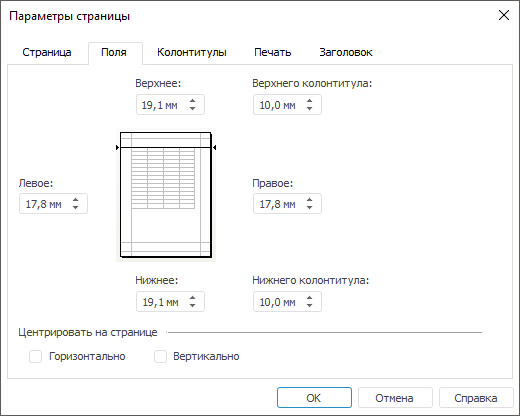

# Поля на странице: Регламентный отчёт, настольное приложение

Поля на странице: Регламентный отчёт, настольное приложение
-

# Поля на странице

Для полей на странице отчёта доступна [быстрая](UiReport_Tuning_ParamPage.htm#quick)
 и расширенная настройка.

Примечание.
 Набор параметров быстрой и расширенной настройки отличается.

Для расширенной настройки полей на странице:

	- Откройте окно «Параметры страницы»
	 с помощью команды главного меню:

		- «Отчет > Печать
		 > Параметры
		 страницы» в регламентном отчёте;

		- «Форма ввода/вывода >
		 Печать > Параметры страницы» в [форме ввода](DataEntryForms.chm::/DataEntryForms_Purpose.htm).

	- Перейдите на вкладку «Поля»:

	- Задайте параметры:

		- «Верхнее», «Нижнее», «Левое»
		 и «Правое». Установите
		 интервал между соответствующим полем и краем печатной страницы;

		- «Верхнего колонтитула»
		 и «Нижнего колонтитула».
		 Установите расстояние между верхним колонтитулом и верхом страницы
		 и между нижним колонтитулом и низом страницы в миллиметрах. Это
		 расстояние должно быть меньше размера верхнего и нижнего полей
		 соответственно.

Примечание.
 Доступен ввод значения [в разных системах измерения](UiNav.chm::/GUI/Format/Different_units.htm). В поле ввода редактора отображаются
 значения в единицах измерения, соответствующих текущим региональным настройкам
 операционной системы.

	- Выберите способ, по которому будут отцентрированы объекты листа,
	 в группе параметров «Центрировать
	 на странице»:

		- Горизонтально. При
		 установке флажка объекты на листе отчёта будут отцентрированы
		 по горизонтали;

		- Вертикально. При
		 установке флажка объекты на листе отчёта будут отцентрированы
		 по вертикали.

После выполнения действий будут заданы поля страницы
 для [печати](../../Reports/OperationReport/UiReport_Reports_Operation_Print.htm).

См. также:

[Начало
 работы с инструментом «Отчёты» в веб-приложении](../../../Web/organizational_management/Starting.htm) | [Настройка
 отчёта под печать](UiReport_Tuning_ParamPage.htm) | [Построение
 отчёта](../../CreateReport.htm) | [Работа
 с готовым отчётом](../../Reports/OperationReport/Work_witn_report.htm)

		Справочная
		 система на версию 10.9
		 от 18/08/2025,
		 © ООО «ФОРСАЙТ»,
