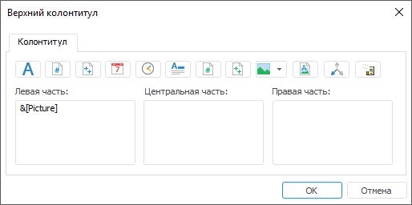
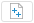
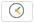
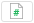
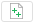
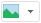
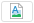

# Колонтитулы на странице: Регламентный отчёт, настольное приложение

Колонтитулы на странице: Регламентный отчёт, настольное приложение
-

# Колонтитулы на странице

Для настройки колонтитулов на странице:

	- Откройте окно «Параметры страницы»
	 с помощью команды главного меню:

		- «Отчет > Печать
		 > Параметры
		 страницы» в регламентном отчёте;

		- «Форма ввода/вывода >
		 Печать > Параметры страницы» в [форме ввода](DataEntryForms.chm::/DataEntryForms_Purpose.htm).

	- Перейдите на вкладку «Колонтитулы»:

	- На вкладке «Колонтитулы»
	 в комбинированных списках выберите один из предустановленных видов
	 верхнего и/или нижнего колонтитула или создайте собственный.

	- Если для четных и нечетных страниц требуется задать различные
	 колонтитулы, установите флажок «Разные
	 колонтитулы для четных и нечетных страниц». По умолчанию
	 флажок не установлен. Если флажок установлен, то настройка колонтитулов
	 для четных и нечетных страниц производится отдельно. Если флажок не
	 установлен, то четные и нечетные страницы имеют одинаковые настройки
	 колонтитулов.

	- Для задания колонтитула на первой страницы установите флажок
	 «Особый колонтитул для первой страницы».
	 По умолчанию флажок не установлен. Если флажок установлен, то настройка
	 колонтитула для первой страницы производится отдельно от настройки
	 колонтитулов для остальных страниц. Если флажок не установлен, то
	 для всех страниц, начиная с первой, отображаются одинаковые колонтитулы.

[Особенности
 работы с колонтитулами четных, нечетных и первой страниц](javascript:TextPopup(this))

	Если сначала были заданы колонтитулы
	 для всех страниц, а затем установлены флажки «Разные
	 колонтитулы для четных и нечетных страниц» и/или «Особый
	 колонтитул для первой страницы», то по умолчанию в качестве
	 колонтитулов для четных, нечетных и первой страниц будут использоваться
	 колонтитулы, установленные для всех страниц отчёта.

	Если сначала были заданы колонтитулы
	 для четных и нечетных страниц, а затем установлен флажок «Особый
	 колонтитул для первой страницы», то по умолчанию в качестве
	 колонтитула для первой страницы будет использоваться колонтитул, установленный
	 для нечетных страниц отчёта.

	Для настройки особых колонтитулов выполните
	 его [редактирование](#edit).

	- Для редактирования колонтитула нажмите кнопку
	 «Настроить верхний колонтитул»
	 или «Настроить нижний колонтитул».
	 Будет открыто окно редактирования колонтитулов:

Примечание.
 Диалоги создания верхнего и нижнего колонтитула подобны.

В зависимости от флажков, установленных на
 вкладке «Колонтитулы»
 окна «Параметры страницы», окно
 редактирования колонтитулов будет содержать различные вкладки:

		- если не были установлены флажки «Разные
		 колонтитулы для четных и нечетных страниц» и «Особый
		 колонтитул для первой страницы», окно редактирования колонтитулов
		 будет содержать вкладку «Колонтитулы»;

		- если был установлен флажок «Разные
		 колонтитулы для четных и нечетных страниц», окно редактирования
		 колонтитулов будет содержать вкладки «Колонтитул
		 чётной страницы» и «Колонтитул
		 нечётной страницы», аналогичные вкладке «Колонтитул»;

		- если был установлен флажок «Особый
		 колонтитул для первой страницы», окно редактирования колонтитулов
		 будет содержать вкладки «Колонтитул»
		 и «Колонтитул первой страницы»,
		 аналогичные вкладке «Колонтитул»;

		- если были установлены оба флажка, окно редактирования колонтитулов
		 будет содержать вкладки «Колонтитул
		 чётной страницы», «Колонтитул
		 нечётной страницы» и «Колонтитул
		 первой страницы», аналогичные вкладке «Колонтитул».

Область колонтитула условно разделена на
 три части, отличающиеся способом выравнивания содержимого: по левому краю,
 по центру или по правому краю. Каждая часть имеет свои собственные параметры.

Расположение колонтитулов на листе отчёта
 задается на этапе формирования каждого колонтитула с использованием специальных
 подстановок или ввода статичного текста в выбранную часть колонтитула.

[Варианты
 подстановок](javascript:TextPopup(this))

			 Кнопка
			 Подстановка/тег
			 Описание

			 
			 Формат шрифта
			 При нажатии на кнопку будет открыто окно для настройки
			 [параметров шрифта](Format_Font.htm) в колонтитуле.

			 
			 &[Page]
			 При нажатии на кнопку в текущую позицию будет выведен номер
			 текущей страницы.

			 
			 &[Pages]
			 При нажатии на кнопку в текущую позицию будет выведено
			 количество страниц текущего отчёта.

			 
			 &[Date]
			 При нажатии на кнопку в текущую позицию будет выведена
			 текущая дата.

			 
			 &[Time]
			 При нажатии на кнопку в текущую позицию будет выведено
			 текущее время.

			 
			 &[Name]
			 При нажатии на кнопку в текущую позицию будет выведено
			 наименование отчёта.

			 
			 &[Sheet.Page]
			 При нажатии на кнопку в текущую позицию будет выведен номер
			 страницы на текущем листе.

			 
			 &[Sheet.Pages]
			 При нажатии на кнопку в текущую позицию будет выведено
			 количество страниц текущего листа отчёта.

			 
			 Вставка изображения
			 При нажатии на кнопку в текущую позицию будет вставлено
			 [изображение](UiReport_Tuning_ParamPage_3_Insert_Picture.htm)
			 из репозитория или файла.

			 
			 Формат изображения
			 При нажатии на кнопку будет открыто окно для настройки
			 [формата
			 изображения](UiReport_Tuning_ParamPage_3_Insert_Picture.htm#aspect_ratio).
			Примечание.
			 Кнопка доступна, если в колонтитуле используется изображение.

			 
			 Отметка по измерениям
			 При нажатии на кнопку в текущую позицию будет выведена
			 [отметка по
			 измерениям](UiReport_Tuning_ParamPage_3_Slice.htm).

			 &[<Идентификатор среза>.Selection]
			 В текущую позицию будет выведена отметка по фиксированным
			 измерениям среза.

			 &[<Идентификатор среза>.<Идентификатор справочника>.Selection]
			 В текущую позицию будет выведена отметка заданного измерения.

			 
			 &[<Идентификатор листа>.<Идентификатор элемента
			 управления>.Value]
			 При нажатии на кнопку в текущую позицию будет выведено
			 [значение
			 элемента управления](UiReport_Tuning_ParamPage_3_Control.htm).

			 &[Globals.<Идентификатор переменной>]
			 В текущую позицию будет выведено значение [глобальной
			 переменной](UiNav.chm::/02_Navigator/UiNav_GlobalVariables.htm).

	- Сохраните структуру колонтитула.

После выполнения действий созданный колонтитул будет добавлен в список
 к стандартным вариантам и будет автоматически установлен в комбинированном
 списке «Верхний/нижний колонтитул».

Примечание.
 При настройке колонтитулов учитывайте особенности [экспорта
 отчёта](../../Reports/OperationReport/UiReport_Reports_Operation_Export.htm) в различные форматы.

См. также:

[Начало
 работы с инструментом «Отчёты» в веб-приложении](../../../Web/organizational_management/Starting.htm) | [Настройка
 отчёта под печать](UiReport_Tuning_ParamPage.htm) | [Построение
 отчёта](../../CreateReport.htm) | [Работа
 с готовым отчётом](../../Reports/OperationReport/Work_witn_report.htm)

		Справочная
		 система на версию 10.9
		 от 18/08/2025,
		 © ООО «ФОРСАЙТ»,
