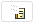
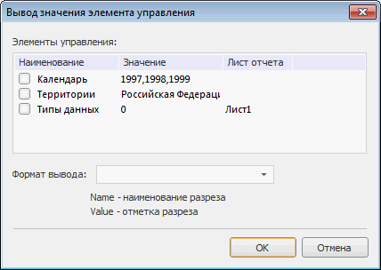

# Вывод значения элемента управления в колонтитул

Вывод значения элемента управления в колонтитул
-

# Вывод значения элемента управления

Для добавления значения элемента управления в колонтитул нажмите кнопку
 
 в [окне редактирования колонтитула](UiReport_Tuning_ParamPage_3.htm#edit).
 Будет открыто окно «Вывод
 значения элемента управления»:

В открывшемся окне определите следующие параметры:

	- Элементы управления.
	 В списке отображены все имеющиеся элементы управления отчётом с указанием
	 их текущего значения и листа, к которому они применяются. В случае
	 если лист не указан, то элемент управления доступен для всех листов.
	 Установите флажки напротив элементов управления, значения которых
	 необходимо выводить в колонтитул.

	При работе со списком в группе «Элементы
	 управления» обратите внимание на следующие особенности:

		- Список элементов управления
		 предусматривает множественное выделение элементов при зажатой
		 клавише SHIFT или CTRL. При установке/снятии флажка у одного из
		 выделенных элементов у других выделенных элементов флажок устанавливается/снимается;

		- Для установки/снятия флажка
		 для всех элементов списка:

			- выполните команду контекстного меню «Включить
			 все/Выключить все»;

			- нажмите сочетание клавиш CTRL+A;

		- Для установки/снятия флажка
		 для выделенных элементов выполните команду контекстного меню «Включить/Выключить»;

	- Формат вывода. В комбинированном
	 списке укажите вариант формата или выберите формата вывода значений
	 элементов управления из имеющихся вариантов. Подстановки Name
	 и Value используются для
	 вывода имени элемента управления и его значения соответственно.

После нажатия кнопки «ОК» в
 соответствующую часть колонтитула будет добавлено по одному тегу на каждый
 выбранный элемент управления:

&[<Идентификатор листа>.<Идентификатор
 элемента управления>.Value Format = "<Выбранный/созданный формат>"]

Где:

	- Идентификатор листа
	 может быть пропущен, если элемент управления доступен для всех листов;

	- Format является необязательным
	 атрибутом. Если атрибут Format
	 не указан, то будет выведено только значение элемента управления (Value).

После создания тега редактировать и удалить его можно только вручную,
 повторный вызов данного диалога не предусматривает его редактирования.

Если до нажатия кнопки «ОК»
 не был выбран формат вывода, то будет предложено установить формат вывода
 отметки по умолчанию.

См. также:

[Начало
 работы с инструментом «Отчёты» в веб-приложении](../../../Web/organizational_management/Starting.htm) | [Колонтитулы
 на странице](UiReport_Tuning_ParamPage_3.htm) | [Настройка
 отчёта под печать](UiReport_Tuning_ParamPage.htm) | [Построение
 отчёта](../../CreateReport.htm) | [Работа
 с готовым отчётом](../../Reports/OperationReport/Work_witn_report.htm)

		Справочная
		 система на версию 10.9
		 от 18/08/2025,
		 © ООО «ФОРСАЙТ»,
