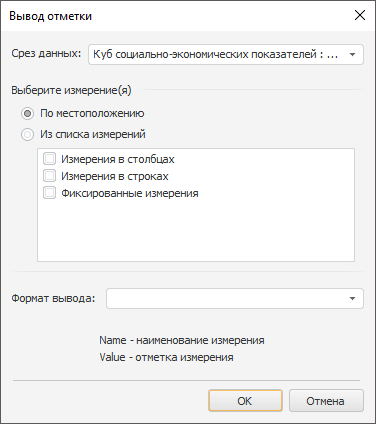
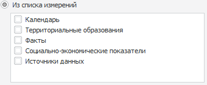

# Вывод отметки по измерениям

Вывод отметки по измерениям
-

# Вывод отметки по измерениям

Для добавления отметки в колонтитул нажмите кнопку 
 в [окне редактирования колонтитула](UiReport_Tuning_ParamPage_3.htm#edit).
 Будет открыто окно «Вывод
 отметки»:

В открывшемся окне определите следующие параметры:

[Срез данных](javascript:TextPopup(this))

	Из раскрывающегося списка имеющихся в текущем регламентном отчёте
	 срезов выберите срез данных, отметка измерения которого будет использована.

[Выберите измерение(я)](javascript:TextPopup(this))

	Определите измерения, отметка которых будет выведена в колонтитул:

		- По местоположению.
		 Данный вариант предусматривает выбор измерений в зависимости от
		 их расположения в срезе. При установке данного переключателя в
		 области ниже установите флажки напротив необходимого расположения:

			- Измерения в столбцах;

			- Измерения в строках;

			- Фиксированные измерения;

		- Из списка измерений.
		 Данный вариант предусматривает выбор измерений из списка независимо
		 от их положения в срезе. При установке данного переключателя в
		 области ниже будет представлен список всех имеющихся справочников
		 в срезе. Отметьте флажками необходимые справочники:

	

	При работе со списком в группе «Выберите
	 измерение(я)» обратите внимание на следующие особенности:

		- Списки выбора измерений предусматривают множественное выделение
		 элементов. При установке/снятии флажка у одного из выделенных
		 элементов у других выделенных элементов флажок устанавливается/снимается;

		- Для установки/снятия флажка для всех элементов списка:

			- выполните команду контекстного меню «Включить
			 все/Выключить все»;

			- нажмите сочетание клавиш CTRL+A;

		- Для установки/снятия флажка для выделенных элементов выполните
		 команду контекстного меню «Включить/Выключить».

[Формат вывода](javascript:TextPopup(this))

	В комбинированном списке «Формат
	 вывода» укажите вариант формата либо выберите из имеющихся
	 вариантов. Подстановки Name
	 и Value используются для
	 вывода имени измерения и его отметки соответственно.

После нажатия кнопки «ОК» в
 соответствующую часть колонтитула будет добавлено по одному тегу:

	- на каждое выбранное местоположение:

&[<Наименование
 среза>.Selection Part = "<выбранная часть Rows|Columns|Fixed>"
 Format = "<Выбранный/созданный формат>"]

Примечание.
 Если атрибут Part не указан, то
 будет выведена отметка по фиксированным измерениям.

	- на каждое выбранное измерение:

&[<Наименование
 среза>.<Идентификатор справочника>.Selection Format = "<Выбранный/созданный
 формат>"]

Примечание.
 Если атрибут Format не указан,
 то будет выведено только значение отметки (Value).

После создания тега редактировать и удалить его можно только вручную,
 повторный вызов данного диалога не предусматривает его редактирования.

Если до нажатия кнопки «ОК»
 не был выбран формат вывода, то будет предложено установить формат вывода
 отметки по умолчанию.

См. также:

[Начало
 работы с инструментом «Отчёты» в веб-приложении](../../../Web/organizational_management/Starting.htm) | [Колонтитулы
 на странице](UiReport_Tuning_ParamPage_3.htm) | [Настройка
 отчёта под печать](UiReport_Tuning_ParamPage.htm) | [Построение
 отчёта](../../CreateReport.htm) | [Работа
 с готовым отчётом](../../Reports/OperationReport/Work_witn_report.htm)

		Справочная
		 система на версию 10.9
		 от 18/08/2025,
		 © ООО «ФОРСАЙТ»,
