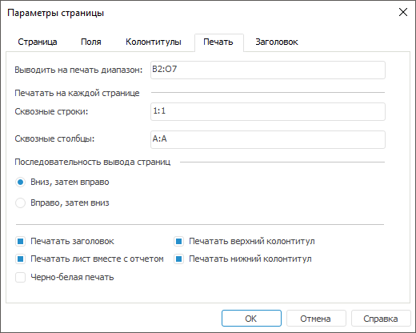

# Параметры печати: Регламентный отчёт, настольное приложение

Параметры печати: Регламентный отчёт, настольное приложение
-

# Параметры печати

Для настройки параметров печати:

	- Откройте окно «Параметры страницы»
	 с помощью команды главного меню:

		- «Отчет > Печать
		 > Параметры
		 страницы» в регламентном отчёте;

		- «Форма ввода/вывода >
		 Печать > Параметры страницы» в [форме ввода](DataEntryForms.chm::/DataEntryForms_Purpose.htm).

	- Перейдите на вкладку «Печать»:

	- Задайте параметры печати:

[Выводить
 на печать диапазон](javascript:TextPopup(this))

	В поле «Выводить
	 на печать диапазон» задайте диапазон листа, который необходимо
	 напечатать.

	Для задания диапазона листа:

			- с помощью мыши выделите требуемый диапазон ячеек;

			- с помощью клавиатуры введите требуемый диапазон ячеек.

[Печатать
 на каждой странице](javascript:TextPopup(this))

	В полях «Сквозные
	 строки» и «Сквозные столбцы»
	 задайте диапазоны строк и/или столбцов, которые необходимо вывести
	 на каждый печатный лист.

	Примечание.
	 Задание сквозных строк/столбцов доступно только для того листа, на
	 котором было открыто окно «Параметры
	 страницы».

	При задании диапазонов строк/столбцов
	 учитывайте следующие особенности:

			- диапазоны для сквозных строк/столбцов должны быть полными
			 строками/столбцами;

			- при вводе составного диапазона непрерывные диапазоны
			 разделяются знаком «;»;

			- при выделении с помощью мыши ячейки или диапазона ячеек
			 выделяются все строки/столбцы, в которые попадают выделенные
			 ячейки;

			- для выделения составного диапазона сквозных строк/столбцов
			 с помощью мыши удерживайте зажатой клавишу CTRL;

			- если введенный с помощью клавиатуры или выделенный с
			 помощью мыши диапазон не является полными строками/столбцами,
			 он будет заменён на диапазоны полных строк/столбцов, в которые
			 попадают выделенные ячейки. Например, если были введены сквозные
			 строки: A1:F1; A10:A12, то они будут заменены на
			 1:1; 10:12;

			- если заданы пересекающиеся или находящиеся рядом
			 диапазоны (например, 0:0 и 1:1), то они будут объединены в
			 один диапазон;

			- при задании нескольких диапазонов они будут упорядочены
			 в полях «Сквозные строки»
			 и «Сквозные столбцы»
			 в порядке сверху вниз для строк и слева направо - для столбцов.

[Последовательность
 вывода страниц](javascript:TextPopup(this))

	Для настройки последовательности вывода
	 страниц на печать установите один из переключателей:

			- Вниз, затем вправо.
			 Страницы отчёта выводятся на печать в порядке вниз, затем
			 вправо;

			- Вправо, затем вниз.
			 Страницы отчёта выводятся на печать в порядке вправо, затем
			 вниз.

	При задании составного диапазона [сквозных
	 строк/столбцов](#print_every_page) учитывайте следующие особенности последовательности
	 вывода:

			- если было задано два и более диапазонов сквозных строк,
			 то сначала выводятся данные, находящиеся между первым и вторым
			 диапазоном сквозных строк, потом между вторым и третьим и
			 т.д. Если при этом был задан диапазон сквозных столбцов, то
			 он будет прерываться диапазонами сквозных строк;

			- если в отчёте содержится несколько таблиц, по ширине
			 полностью помещающихся на один лист, для таблиц заданы сквозные
			 строки и при выводе таблицы на странице остается свободное
			 место, то следующая за ней таблица будет выведена на той же
			 странице с учётом заданной для нее сквозной строки и с хотя
			 бы одной строкой данных;

			- при задании сквозной строки для нескольких таблиц, находящихся
			 друг за другом, необходимо учитывать, что диапазон сквозных
			 строк задается для всей строки, а не для диапазона ячеек;

			- если было задано два и более диапазонов сквозных столбцов,
			 то сначала выводятся данные, находящиеся между первым и вторым
			 диапазоном сквозных столбцов, потом между вторым и третьим
			 и т.д. Если при этом был задан диапазон сквозных строк, то
			 он будет прерываться диапазонами сквозных столбцов;

			- если в отчёте содержится несколько таблиц, по высоте
			 полностью помещающихся на один лист, для таблиц заданы сквозные
			 столбцы и при выводе таблицы на странице остается свободное
			 место, то следующая за ней таблица будет выведена на той же
			 странице с учётом заданного для нее сквозного столбца и с
			 хотя бы одним столбцом данных;

			- при задании сквозного столбца для нескольких таблиц,
			 находящихся друг под другом, необходимо учитывать, что диапазон
			 сквозных столбцов задается для всего столбца, а не для диапазона
			 ячеек.

[Печатать
 заголовок](javascript:TextPopup(this))

	Для вывода на печать заголовка отчёта
	 установите флажок «Печатать заголовок».

	Примечание.
	 Заголовок отображается только на первой странице каждого листа отчёта.

	Настройка заголовка отчёта выполняется
	 на вкладке «[Заголовок](UiReport_Tuning_ParamPage_5.htm)».

[Печатать
 лист вместе с отчетом](javascript:TextPopup(this))

	Для вывода на печать текущего листа отчёта
	 установите флажок «Печатать лист
	 вместе с отчетом». По умолчанию флажок установлен.

	Примечание.
	 Флажок автоматически снимается [при
	 скрытии листа](../../Sheets/UiReport_Sheets_hide.htm) и не восстанавливается, если к листу будет применено
	 отображение.

	При снятом флажке лист отчёта не будет
	 выводиться на печать. При этом:

			- при печати отчёта целиком данный лист не печатается;

	Примечание.
	 Если открыт непечатный лист отчёта и при печати задан параметр «[Выделенный
	 диапазон](uinav.chm::/GUI/Print_setup.htm)» для печати определенной области на листе
	 отчёта, то данный лист будет напечатан отдельно от всего отчёта.

			- при печати только этого листа в окне «[Печать](../../Reports/OperationReport/UiReport_Reports_Operation_Print.htm)»
			 в раскрывающемся списке «Вывести
			 на печать» недоступен вариант печати «Весь
			 отчет»;

			- при предпросмотре листа в окне «[Предварительный
			 просмотр](uinav.chm::/GUI/Object_preview.htm)» в списке листов будет доступен
			 только данный лист;

			- при предпросмотре других листов в окне «[Предварительный
			 просмотр](uinav.chm::/GUI/Object_preview.htm)» в списке листов будет отсутствовать
			 данный лист;

			- при  в форматы PDF, RTF данный лист недоступен
			 для экспорта.

	Примечание.
	 Если экспорт выполняется при открытом непечатном листе отчёта, то
	 для экспорта будет доступен только данный лист.

[Печать
 верхнего и нижнего колонтитулов](javascript:TextPopup(this))

	При снятом флажке «Печатать
	 верхний колонтитул» или «Печатать
	 нижний колонтитул» верхний или нижний колонтитул будет скрыт.

[Черно-белая
 печать](javascript:TextPopup(this))

	При установленном флажке «Черно-белая
	 печать» все цветовое оформление при печати и предварительном
	 просмотре сбрасывается: весь текст и колонтитулы печатаются в оттенках
	 серого независимо от настроенных цветов, фон будет белого цвета. По
	 умолчанию флажок снят.

	Примечание.
	 Если используется черно-белая печать, то при предварительном просмотре
	 возможно ухудшение качества изображения. На качество печати данная
	 особенность не влияет.

После выполнения действий будут заданы параметры
 для [печати](../../Reports/OperationReport/UiReport_Reports_Operation_Print.htm).

См. также:

[Начало
 работы с инструментом «Отчёты» в веб-приложении](../../../Web/organizational_management/Starting.htm) | [Предварительный
 просмотр и печать отчёта](../../Reports/OperationReport/UiReport_Reports_Operation_Print.htm) | [Настройка
 отчёта под печать](UiReport_Tuning_ParamPage.htm) | [Построение
 отчёта](../../CreateReport.htm) | [Работа
 с готовым отчётом](../../Reports/OperationReport/Work_witn_report.htm)

		Справочная
		 система на версию 10.9
		 от 18/08/2025,
		 © ООО «ФОРСАЙТ»,
