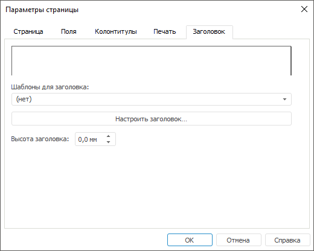

# Заголовок отчёта: Регламентный отчёт, настольное приложение

Заголовок отчёта: Регламентный отчёт, настольное приложение
-

# Заголовок отчёта

Для настройки заголовка отчёта:

	- Откройте окно «Параметры страницы»
	 с помощью команды главного меню:

		- «Отчет > Печать
		 > Параметры
		 страницы» в регламентном отчёте;

		- «Форма ввода/вывода >
		 Печать > Параметры страницы» в [форме ввода](DataEntryForms.chm::/DataEntryForms_Purpose.htm).

	- Перейдите на вкладку «[Печать](UiReport_Tuning_ParamPage_4.htm)»
	 и установите флажок «Печатать заголовок».

	- Перейдите на вкладку «Заголовок»:

Примечание.
 Заголовок отображается только на первой странице каждого листа отчёта,
 в отличие от [колонтитулов](UiReport_Tuning_ParamPage_3.htm),
 отображаемых на каждой странице.

	- Задайте параметры заголовка:

		- Шаблоны для заголовка.
		 Из раскрывающегося списка выберите один из шаблонов заголовка
		 либо создайте собственный формат;

		- Настроить заголовок.
		 Для настройки заголовка нажмите данную кнопку. Откроется диалог,
		 работа с которым подобна работе при создании [колонтитула](UiReport_Tuning_ParamPage_3.htm#edit);

		- Высота заголовка.
		 Установите высоту заголовка в строке редактирования. Высота заголовка
		 задается в миллиметрах.

После выполнения действий при [печати](../../Reports/OperationReport/UiReport_Reports_Operation_Print.htm)
 отчёта будет отображаться настроенный заголовок.

См. также:

[Начало
 работы с инструментом «Отчёты» в веб-приложении](../../../Web/organizational_management/Starting.htm) | [Настройка
 отчёта под печать](UiReport_Tuning_ParamPage.htm) | [Построение
 отчёта](../../CreateReport.htm) | [Работа
 с готовым отчётом](../../Reports/OperationReport/Work_witn_report.htm)

		Справочная
		 система на версию 10.9
		 от 18/08/2025,
		 © ООО «ФОРСАЙТ»,
