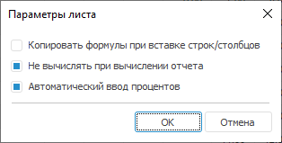

# Параметры листа

Параметры листа
-

# Параметры листа

Для настройки основных параметров листа:

	- выполните команду «Формат >
	 Параметры листа» в группе «Ячейки»
	 на вкладке «Главная» ленты
	 инструментов;

	- выполните команду «Параметры
	 листа» контекстного меню вкладки выбранного листа.

Откроется окно «Параметры листа»:

При настройке параметров листа доступны следующие параметры:

	- Копировать формулы при вставке
	 строк/столбцов. При установленном флажке скопированный диапазон
	 ячеек с формулами будет вставлен в виде формул из скопированных ячеек;

	- Не вычислять при вычислении
	 отчёта. При установленном флажке выбранный лист не будет вычисляться
	 при вычислении отчёта;

	- Автоматический ввод процентов.
	 При установленном флажке при вводе числа в ячейки с форматом числа
	 «[Процентный](UiNav.chm::/GUI/Format/UiReport_Table_Attribute_Format.htm#percentage)» будет
	 автоматически отображаться значок процента «%».
	 Например, вводя 10, получаем 10%, вводя 0,1 - 0,10%. При снятии флажка
	 все числа, вводимые в ячейки с форматом числа «[Процентный](UiNav.chm::/GUI/Format/UiReport_Table_Attribute_Format.htm#percentage)», умножаются
	 на 100.

Примечание.
 Состояние флажка не сохраняется с отчётом. Его состояние хранится в параметре
 «AutoPercentEntry» ветки реестра:
 HKEY_CURRENT_USER\Software\Foresight\Foresight Analytics Platform\10.0\TabSheet.

См. также:

[Начало
 работы с инструментом «Отчёты» в веб-приложении](../../Web/organizational_management/Starting.htm) | [Добавление
 нового листа и работа с ним](../Sheets/UiReport_Sheets.htm) | [Формат числа](UiNav.chm::/GUI/Format/UiReport_Table_Attribute_Format.htm)

		Справочная
		 система на версию 10.9
		 от 18/08/2025,
		 © ООО «ФОРСАЙТ»,
