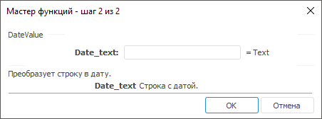

# DateValue: Регламентный отчёт, настольное приложение

DateValue: Регламентный отчёт, настольное приложение
-

# DateValue

[Мастер функций](../../UiReport_Organizational_master_function.htm)
 для функции DateValue выглядит
 следующим образом:

## Синтаксис

Date(Date_text)

## Параметры

Date_text. Строка, которую
 необходимо преобразовать.

Примечание.
 В качестве параметра можно указывать как непосредственно значение параметра,
 так и адрес ячейки, в которой оно располагается.

## Описание

Возвращает результат преобразования строки в дату.

## Пример

		 Формула
		 Результат
		 Описание

		 =DateValue("22.04.2008")
		 22.04.2008
		 Результат преобразования даты, представленной в виде текста
		 22.04.2008.

		 =DateValue(B6)
		 12.05.1864
		 Результат преобразования даты, представленной в виде текста
		 в ячейке B6. Ячейка B6 содержит значение 12.05.1864.

См. также:

[Мастер функций](../../UiReport_Organizational_master_function.htm)
 │ [Дата
 и время](UiReport_Func_DateTime.htm) │ [TimeValue](UiReport_Func_DateTime_TimeValue.htm)

		Справочная
		 система на версию 10.9
		 от 18/08/2025,
		 © ООО «ФОРСАЙТ»,
