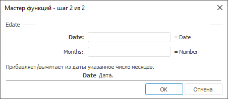

# Edate: Регламентный отчёт, настольное приложение

Edate: Регламентный отчёт, настольное приложение
-

# Edate

[Мастер функций](../../UiReport_Organizational_master_function.htm)
 для функции Edate выглядит следующим
 образом:

## Синтаксис

Edate(Date, Months)

## Параметры

Date. Дата, которую необходимо
 увеличить/уменьшить;

Months. Число месяцев, на которое
 будет изменена указанная дата.

Примечание.
 В качестве параметра можно указывать как непосредственно значение параметра,
 так и адрес ячейки, в которой оно располагается.

## Описание

Возвращает дату, увеличенную/уменьшенную на заданное число месяцев.

## Комментарии

Если в качестве параметра будет указано положительное число, то заданная
 дата увеличится, если отрицательное - уменьшится.

## Пример

		 Формула
		 Результат
		 Описание

		 =Edate("21.06.2008", -5)
		 21.01.2008
		 Дата 21.06.2008, уменьшенная на пять месяцев.

		 =Edate(B6,B7)
		 01.01.2008
		 Дата в ячейке B6, измененная на число месяцев, указанных в
		 ячейке B7. Ячейка B6 содержит значение 01.01.2007, B7 содержит
		 значение 12.

См. также:

[Мастер функций](../../UiReport_Organizational_master_function.htm)
 │ [Дата
 и время](UiReport_Func_DateTime.htm)

		Справочная
		 система на версию 10.9
		 от 18/08/2025,
		 © ООО «ФОРСАЙТ»,
