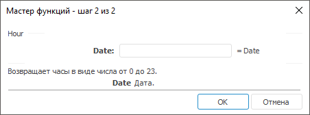

# Hour: Регламентный отчёт, настольное приложение

Hour: Регламентный отчёт, настольное приложение
-

# Hour

[Мастер функций](../../UiReport_Organizational_master_function.htm)
 для функции Hour выглядит следующим
 образом:

## Синтаксис

Hour(Date)

## Параметры

Date. Время, для которого нужно
 выделить часы.

Примечание.
 В качестве параметра можно указывать как непосредственно значение параметра,
 так и адрес ячейки, в которой оно располагается.

## Описание

Возвращает час, соответствующий заданному времени.

## Комментарии

Час определяется как целое число в интервале от 0 до 23.

## Пример

		 Формула
		 Результат
		 Описание

		 =Hour("23:01:01")
		 23
		 Час, соответствующий времени 23:01:01.

		 =Hour(B6)
		 15
		 Час, соответствующий времени, указанному в ячейке B6. Ячейка
		 B6 содержит значение 3:00:00 PM.

См. также:

[Мастер функций](../../UiReport_Organizational_master_function.htm)
 │ [Дата
 и время](UiReport_Func_DateTime.htm) │ [Day](UiReport_Func_DateTime_Day.htm)
 │ [Minute](UiReport_Func_DateTime_Minute.htm)
 │ [Month](UiReport_Func_DateTime_Month.htm)│
 [Now](UiReport_Func_DateTime_Now.htm)
 │ [Second](UiReport_Func_DateTime_Second.htm)
 │ [Today](UiReport_Func_DateTime_Today.htm)
 │ [Weekday](UiReport_Func_DateTime_Weekday.htm)
 │ [Year](UiReport_Func_DateTime_Year.htm)

		Справочная
		 система на версию 10.9
		 от 18/08/2025,
		 © ООО «ФОРСАЙТ»,
