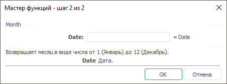

# Month: Регламентный отчёт, настольное приложение

Month: Регламентный отчёт, настольное приложение
-

# Month

[Мастер функций](../../UiReport_Organizational_master_function.htm)
 для функции Month выглядит следующим
 образом:

## Синтаксис

Month: Регламентный отчёт, настольное приложение
 (Date)

## Параметры

Date. Дата, для которой необходимо
 выделить месяц.

Примечание.
 В качестве параметра можно указывать как непосредственно значение параметра,
 так и адрес ячейки, в которой оно располагается.

## Описание

Возвращает месяц в заданной дате.

## Комментарии

Месяц возвращается как целое число в диапазоне от 1 до 12.

## Пример

		 Формула
		 Результат
		 Описание

		 =Month: Регламентный отчёт, настольное приложение
		 ("31.10.2008")
		 10
		 Месяц в указанной дате: 31.10.2008.

		 =Month: Регламентный отчёт, настольное приложение
		 (B6)
		 1
		 Месяц даты, указанной в ячейке B6. Ячейка B6 содержит значение
		 26 янв 07.

См. также:

[Мастер функций](../../UiReport_Organizational_master_function.htm)
 │ [Дата
 и время](UiReport_Func_DateTime.htm) │ [Day](UiReport_Func_DateTime_Day.htm)
 │ [Hour](UiReport_Func_DateTime_Hour.htm)
 │ [Minute](UiReport_Func_DateTime_Minute.htm)
 │ [Now](UiReport_Func_DateTime_Now.htm)
 │ [Second](UiReport_Func_DateTime_Second.htm)
 │ [Today](UiReport_Func_DateTime_Today.htm)
 │ [Weekday](UiReport_Func_DateTime_Weekday.htm)
 │ [Year](UiReport_Func_DateTime_Year.htm)

		Справочная
		 система на версию 10.9
		 от 18/08/2025,
		 © ООО «ФОРСАЙТ»,
