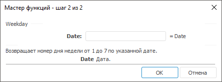

# Weekday: Регламентный отчёт, настольное приложение

Weekday: Регламентный отчёт, настольное приложение
-

# Weekday

[Мастер функций](../../UiReport_Organizational_master_function.htm)
 для функции Weekday выглядит следующим
 образом:

## Синтаксис

Weekday(Date)

## Параметры

Date. Дата, день которой необходимо
 найти.

Примечание.
 В качестве параметра можно указывать как непосредственно значение параметра,
 так и адрес ячейки, в которой оно располагается.

## Описание

Возвращает номер дня недели по указанной дате.

## Комментарии

День недели возвращается как целое число в диапазоне от 1 (понедельник)
 до 7 (воскресенье).

## Пример

		 Формула
		 Результат
		 Описание

		 =Weekday("31.10.2008")
		 5
		 День недели указанной даты: 31.10.2008.

		 =Weekday(B6)
		 6
		 День недели даты, указанной в ячейке B6. Ячейка B6 содержит
		 значение 26 янв 08.

См. также:

[Мастер функций](../../UiReport_Organizational_master_function.htm)
 │ [Дата
 и время](UiReport_Func_DateTime.htm) │ [Day](UiReport_Func_DateTime_Day.htm)
 │ [Hour](UiReport_Func_DateTime_Hour.htm)
 │ [Minute](UiReport_Func_DateTime_Minute.htm)
 │ [Month](UiReport_Func_DateTime_Month.htm)
 │ [Now](UiReport_Func_DateTime_Now.htm)
 │ [Second](UiReport_Func_DateTime_Second.htm)
 │ [Today](UiReport_Func_DateTime_Today.htm)
 │ [Year](UiReport_Func_DateTime_Year.htm)

		Справочная
		 система на версию 10.9
		 от 18/08/2025,
		 © ООО «ФОРСАЙТ»,
