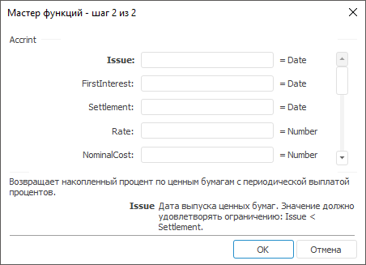

# Accrint: Регламентный отчёт, настольное приложение

Accrint: Регламентный отчёт, настольное приложение
-

# Accrint

[Мастер функций](../../UiReport_Organizational_master_function.htm)
 для функции Accrint выглядит следующим
 образом:

## Синтаксис

Accrint(Issue, FirstInterest, Settlement, Rate[,
 NominalCost[, Frequency[, Basis])

## Параметры

Issue. Дата выпуска ценных
 бумаг;

FirstInterest. Дата первой
 выплаты по ценным бумагам;

Settlement. Срок погашения
 ценных бумаг;

Rate. Годовая процентная ставка
 для купонов по ценным бумагам. Значение параметра должно быть больше нуля;

NominalCost. Номинальная стоимость
 ценных бумаг. Значение параметра должно быть больше нуля;

Frequency. Количество выплат
 по купонам в год. Параметр может принимать следующие значения:

	- 1.
	 Ежегодные выплаты;

	- 2.
	 Полугодовые выплаты;

	- 4.
	 Ежеквартальные выплаты;

Basis. Используемый способ
 вычисления дня. Задается в интервале от 0 до 4:

	- 0.
	 Способ вычисления дня американский. 360 дней (метод NSAD). Значение
	 по умолчанию;

	- 1.
	 Способ вычисления дня фактический/фактический;

	- 2.
	 Способ вычисления дня фактический/360 дней;

	- 3.
	 Способ вычисления дня фактический/365 дней;

	- 4.
	 Способ вычисления дня европейский 30/360 дней.

Необязательный параметр.

Примечание.
 В качестве параметра можно указывать как непосредственно значение параметра,
 так и адрес ячейки, в которой оно располагается.

## Описание

Возвращает накопленный процент по ценным бумагам с периодической выплатой
 процентов.

## Комментарии

Значение параметра Issue должно
 быть меньше значения параметра Settlement.

## Пример

		 Формула
		 Результат
		 Описание

		 =Accrint("11.01.2008", "11.02.2008",
		 "11.03.2008", 0.1, 1000, 2, 0)
		 16,6667
		 Накопленный процент по ценным бумагам на следующих условиях:

			- дата выпуска ценных бумаг 11.01.2008;

			- дата первой выплаты по ценным бумагам 11.02.2008;

			- срок погашения ценных бумаг 11.03.2008;

			- годовая процентная ставка 0,1 %;

			- номинальная стоимость 1000;

			- количество выплат по купонам с год 2, полугодовые выплаты;

			- способ вычисления дня «американский».

		 =Accrint(A1, A2, A3, 0,124, 100, 4, 3)
		 9,2656
		 Накопленный процент по ценным бумагам на следующих условиях:

			- дата выпуска ценных бумаг указана в ячейке A1, значение
			 01.01.2007;

			- дата первой выплаты по ценным бумагам указана в ячейке
			 A2, значение 01.03.2007;

			- срок погашения ценных бумаг указан в ячейке A3, значение
			 01.10.2007;

			- годовая процентная ставка 12,4 %;

			- номинальная стоимость 100;

			- количество выплат по купонам с год 4, ежеквартальные
			 выплаты;

			- способ вычисления дня «фактический/365 дней».

См. также:

[Мастер функций](../../UiReport_Organizational_master_function.htm)
 │ [Финансовые
 функции](UiReport_Func_Finance.htm) │ [IFinance.Accrint](MathLib.chm::/Interface/IFinance/IFinance.Accrint.htm)

		Справочная
		 система на версию 10.9
		 от 18/08/2025,
		 © ООО «ФОРСАЙТ»,
