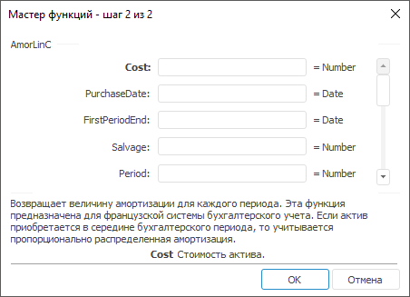

# AmorLinC: Регламентный отчёт, настольное приложение

AmorLinC: Регламентный отчёт, настольное приложение
-

# AmorLinC

[Мастер функций](../../UiReport_Organizational_master_function.htm)
 для функции AmorLinC выглядит
 следующим образом:

## Синтаксис

AmorLinC(Cost, PurchaseDate, FirstPeriodEnd, Salvage[,
 Period[, Rate[, Basis])

## Параметры

Cost. Стоимость актива;

PurchaseDate. Дата приобретения
 актива;

FirstPeriodEnd. Дата окончания
 первого периода;

Salvage. Остаточная стоимость
 актива в конце периода амортизации;

Period. Период. Значение параметра
 должно быть больше либо равно нулю;

Rate. Ставка амортизации. Значение
 параметра должно быть больше нуля;

Basis. Используемый способ
 вычисления дня. Задается в интервале от 0 до 4:

	- 0.
	 Способ вычисления дня американский. 360 дней (метод NSAD). Значение
	 по умолчанию;

	- 1.
	 Способ вычисления дня фактический/фактический;

	- 2.
	 Способ вычисления дня фактический/360 дней;

	- 3.
	 Способ вычисления дня фактический/365 дней;

	- 4.
	 Способ вычисления дня европейский 30/360 дней.

Необязательный параметр.

Примечание.
 В качестве параметра можно указывать как непосредственно значение параметра,
 так и адрес ячейки, в которой оно располагается.

## Описание

Возвращает величину амортизации для каждого периода.

## Комментарии

Функция предназначена для французской системы бухгалтерского учета.
 Если актив приобретается в середине бухгалтерского периода, то учитывается
 пропорционально распределенная амортизация.

## Пример

		 Формула
		 Результат
		 Описание

		 =AmorLinC(2000, "01.01.2008", "01.08.2008",
		 200, 1, 0.15, 3)
		 300
		 Величина амортизации на следующих условиях:

			- стоимость актива 2000;

			- дата приобретения актива 01.01.2008;

			- дата окончания первого периода 01.08.2008;

			- остаточная стоимость актива 200;

			- период 1;

			- ставка амортизации 0,15, полугодовые выплаты;

			- способ вычисления дня «фактический/365 дней».

		 =AmorLinC(A1, A2, A3, 300, 1, 0.15,
		 1)
		 360
		 Величина амортизации на следующих условиях:

			- стоимость актива указана в ячейке A1, значение 2400;

			- дата приобретения актива указана в ячейке A2, значение
			 19.08.2008;

			- дата окончания первого периода указана в ячейке A3,
			 значение 31.12.2008;

			- остаточная стоимость актива 300;

			- период 1;

			- ставка амортизации 0,15, полугодовые выплаты;

			- способ вычисления дня «фактический».

См. также:

[Мастер функций](../../UiReport_Organizational_master_function.htm)
 │ [Финансовые
 функции](UiReport_Func_Finance.htm) │ [IFinance.AmorLinC](MathLib.chm::/Interface/IFinance/IFinance.AmorLinC.htm)

		Справочная
		 система на версию 10.9
		 от 18/08/2025,
		 © ООО «ФОРСАЙТ»,
