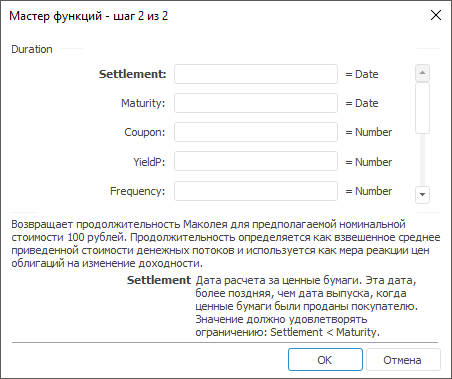

# Duration: Регламентный отчёт, настольное приложение

Duration: Регламентный отчёт, настольное приложение
-

# Duration

[Мастер функций](../../UiReport_Organizational_master_function.htm)
 для функции Duration выглядит
 следующим образом:

## Синтаксис

Duration(Settlement, Maturity, Coupon, YieldP, Frequency[,
 Basis])

## Параметры

Settlement. Дата расчета за
 ценные бумаги. Эта дата более поздняя, чем дата выпуска, когда ценные
 бумаги были проданы покупателю;

Maturity. Срок погашения ценных
 бумаг. Эта дата определяет истечение срока действия ценных бумаг;

Coupon. Годовая процентная
 ставка для купонов по ценным бумагам;

YieldP. Годовой доход по ценным
 бумагам;

Frequency. Количество выплат
 по купонам в год. Обязательный аргумент. Параметр может принимать следующие
 значения:

	- 1.
	 Ежегодные выплаты;

	- 2.
	 Полугодовые выплаты;

	- 4.
	 Ежеквартальные выплаты;

Basis. Используемый способ
 вычисления дня. Задается в интервале от 0 до 4:

	- 0.
	 Способ вычисления дня американский. 360 дней (метод NSAD). Значение
	 по умолчанию;

	- 1.
	 Способ вычисления дня фактический/фактический;

	- 2.
	 Способ вычисления дня фактический/360 дней;

	- 3.
	 Способ вычисления дня фактический/365 дней;

	- 4.
	 Способ вычисления дня европейский 30/360 дней.

Необязательный параметр.

Примечание.
 В качестве параметра можно указывать как непосредственно значение параметра,
 так и адрес ячейки, в которой оно располагается.

## Описание

Возвращает продолжительность Маколея для предполагаемой номинальной
 стоимости 100 рублей.

## Комментарии

Значение параметра Settlement должно
 быть меньше значения параметра Maturity.

Продолжительность определяется как взвешенное среднее приведенной стоимости
 денежных потоков и используется как мера реакции цен облигаций на изменение
 доходности.

## Пример

		 Формула
		 Результат
		 Описание

		 =Duration("01.01.2008", "01.01.2016",
		 0.28, 0.82, 4, 3)
		 1,4979
		 Продолжительность Маколея на следующих условиях:

			- дата расчета за ценные бумаги 01.01.2008;

			- срок погашения ценных бумаг 01.01.2016;

			- годовая процентная ставка 28 %;

			- годовой доход 82 %;

			- количество выплат по купонам с год 4 (ежеквартальные
			 выплаты);

			- способ вычисления дня «фактический/365 дней».

		 =Duration(A1, A2, 0.08, 0.09, 2,
		 1)
		 5,9938
		 Продолжительность Маколея на следующих условиях:

			- дата расчета за ценные бумаги указана в ячейке A1, значение
			 01.01.2008;

			- срок погашения ценных бумаг указан в ячейке A3, значение
			 01.01.2016;

			- годовая процентная ставка 8 %;

			- годовой доход 9 %;

			- количество выплат по купонам в год 2, полугодовые выплаты;

			- способ вычисления дня «американский».

См. также:

[Мастер функций](../../UiReport_Organizational_master_function.htm)
 │ [Финансовые
 функции](UiReport_Func_Finance.htm) │ [IFinance.Duration](MathLib.chm::/Interface/IFinance/IFinance.Duration.htm)

		Справочная
		 система на версию 10.9
		 от 18/08/2025,
		 © ООО «ФОРСАЙТ»,
