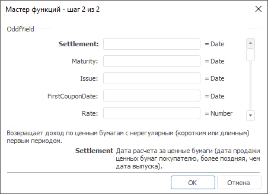

# OddfYield: Регламентный отчёт, настольное приложение

OddfYield: Регламентный отчёт, настольное приложение
-

# OddfYield

[Мастер функций](../../UiReport_Organizational_master_function.htm)
 для функции OddfYield выглядит
 следующим образом:

## Синтаксис

OddfYield(Settlement, Maturity, Issue, FirstCouponDate,
 Rate, PresentValue, Redemption, Frequency, Basis)

## Параметры

Settlement. Дата расчета за
 ценные бумаги (дата продажи ценных бумаг покупателю, более поздняя, чем
 дата выпуска);

Maturity. Срок погашения ценных
 бумаг. Эта дата определяет момент, когда истекает срок действия ценных
 бумаг;

Issue. Дата выпуска ценных
 бумаг;

FirstCouponDate. Дата первой
 купонной выплаты для ценных бумаг;

Rate. Процентная ставка для
 купонов по ценным бумагам. Значение параметра должно быть больше, либо
 равно нулю;

PresentValue. Стоимость ценных
 бумаг;

Redemption. Выкупная стоимость
 ценных бумаг в расчете на 100 рублей номинальной стоимости;

Frequency. Количество купонных
 выплат в год. Обязательный атрибут. Параметр может принимать следующие
 значения:

	- 1.
	 Ежегодные выплаты;

	- 2.
	 Полугодовые выплаты;

	- 4.
	 Ежеквартальные выплаты;

Basis. Используемый способ
 вычисления дня. Задается в интервале от 0 до 4:

	- 0.
	 Способ вычисления дня американский. 360 дней (метод NSAD). Значение
	 по умолчанию;

	- 1.
	 Способ вычисления дня фактический/фактический;

	- 2.
	 Способ вычисления дня фактический/360 дней;

	- 3.
	 Способ вычисления дня фактический/365 дней;

	- 4.
	 Способ вычисления дня европейский 30/360 дней.

Необязательный параметр.

Примечание.
 В качестве параметра можно указывать как непосредственно значение параметра,
 так и адрес ячейки, в которой оно располагается.

## Описание

Возвращает доход по ценным бумагам с нерегулярным (коротким или длинным)
 первым периодом.

## Комментарии

Значение параметра Settlement должно
 быть меньше значения параметра Maturity.

Значение параметра Maturity должно
 быть больше значения параметра FirstCouponDate.

Значение параметра FirstCouponDate
 должно быть больше значения параметра Settlement.

## Пример

		 Формула
		 Результат
		 Описание

		 =OddfYield("11.11.2008", "01.03.2021",
		 "15.10.2008", "01.03.2009", 0.1075, 145.5,
		 200, 4, 3)
		 0,091
		 Доход по ценным бумагам с нерегулярным первым периодом на следующих
		 условиях:

			- дата расчета за ценные бумаги 11.11.2008;

			- срок погашения ценных бумаг 01.03.2021;

			- дата выпуска ценных бумаг 15.10.2008;

			- дата первой купонной выплаты для ценных бумаг 01.03.2009;

			- процентная ставка 10,75 %;

			- стоимость ценных бумаг 145,50;

			- выкупная стоимость ценных бумаг 200;

			- количество выплат по купонам с год 4, ежеквартальные
			 выплаты;

			- способ вычисления дня «фактический».

		 =OddfYield(A1, A2, A3, A4, 0.0575, 84.5, 100,
		 2, 0)
		 0,077
		 Доход по ценным бумагам с нерегулярным первым периодом на следующих
		 условиях:

			- дата расчета за ценные бумаги указана в ячейке A1, значение
			 11.11.2008;

			- срок погашения ценных бумаг указана в ячейке A2, значение
			 01.03.2021;

			- дата выпуска ценных бумаг указана в ячейке A3, значение
			 15.10.2008;

			- дата первой купонной выплаты для ценных бумаг указана
			 в ячейке A4, значение 01.03.2009;

			- процентная ставка 5,75 %;

			- стоимость ценных бумаг 84,5;

			- выкупная стоимость ценных бумаг 100;

			- количество выплат по купонам с год 2, полугодовые выплаты;

			- способ вычисления дня «американский».

См. также:

[Мастер функций](../../UiReport_Organizational_master_function.htm)
 │ [Финансовые
 функции](UiReport_Func_Finance.htm) │ [IFinance.OddfYield](MathLib.chm::/Interface/IFinance/IFinance.OddfYield.htm)

		Справочная
		 система на версию 10.9
		 от 18/08/2025,
		 © ООО «ФОРСАЙТ»,
