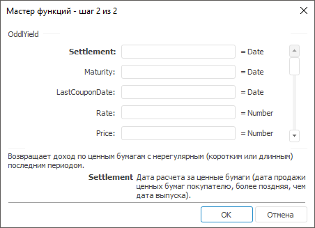

# OddlYield: Регламентный отчёт, настольное приложение

OddlYield: Регламентный отчёт, настольное приложение
-

# OddlYield

[Мастер функций](../../UiReport_Organizational_master_function.htm)
 для функции OddlYield выглядит
 следующим образом:

## Синтаксис

OddlYield(Settlement, Maturity, LastCouponDate,
 Rate, Price, Redemption, Frequency, Basis)

## Параметры

Settlement. Дата расчета за
 ценные бумаги (дата продажи ценных бумаг покупателю, более поздняя, чем
 дата выпуска);

Maturity. Срок погашения ценных
 бумаг. Эта дата определяет момент, когда истекает срок действия ценных
 бумаг;

LastCouponDate. Дата последней
 купонной выплаты для ценных бумаг;

Rate. Процентная ставка для
 ценных бумаг. Значение параметра должно быть больше, либо равно нулю;

Price. Стоимость ценных бумаг.
 Значение параметра должно быть больше, либо равно нулю;

Redemptopn. Выкупная стоимость
 ценных бумаг в расчете на 100 рублей номинальной стоимости;

Frequency. Количество купонных
 выплат в год. Параметр может принимать следующие значения:

	- 1.
	 Ежегодные выплаты;

	- 2.
	 Полугодовые выплаты;

	- 4.
	 Ежеквартальные выплаты;

Basis. Используемый способ
 вычисления дня. Задается в интервале от 0 до 4:

	- 0.
	 Способ вычисления дня американский. 360 дней (метод NSAD). Значение
	 по умолчанию;

	- 1.
	 Способ вычисления дня фактический/фактический;

	- 2.
	 Способ вычисления дня фактический/360 дней;

	- 3.
	 Способ вычисления дня фактический/365 дней;

	- 4.
	 Способ вычисления дня европейский 30/360 дней.

Необязательный параметр.

Примечание.
 В качестве параметра можно указывать как непосредственно значение параметра,
 так и адрес ячейки, в которой оно располагается.

## Описание

Возвращает доход по ценным бумагам с нерегулярным (коротким или длинным)
 последним периодом.

## Комментарии

Значение параметра Settlement должно
 быть меньше значения параметра Maturity.

Значение параметра Maturity
 должно быть больше значения параметра LastCouponDate.

Значение параметра LastCouponDate
 должно быть меньше значения параметра Settlement.

## Пример

		 Формула
		 Результат
		 Описание

		 =OddlYield("20.04.2008", "15.06.2008",
		 "24.12.2007", 0.0275, 101.82, 102, 4, 3)
		 0,039
		 Доход по ценным бумагам с нерегулярным последним периодом на
		 следующих условиях:

			- дата расчета за ценные бумаги20.04.2008;

			- срок погашения ценных бумаг 15.06.2008;

			- дата последней купонной выплаты для ценных бумаг 24.12.2007;

			- процентная ставка 2,75 %;

			- стоимость ценных бумаг 101.82;

			- выкупная стоимость ценных бумаг 102;

			- количество выплат по купонам с год 4, ежеквартальные
			 выплаты;

			- способ вычисления дня «фактический».

		 =OddlYield(A1, A2, A3, 0.0375, 99.88, 100, 2,
		 1)
		 0,045
		 Доход по ценным бумагам с нерегулярным последним периодом на
		 следующих условиях:

			- дата расчета за ценные бумаги указана в ячейке A1, значение
			 20.04.2008;

			- срок погашения ценных бумаг указана в ячейке A2, значение
			 15.06.2008;

			- дата последней купонной выплаты для ценных бумаг указана
			 в ячейке A3, значение 24.12.2007;

			- процентная ставка 3,75 %;

			- стоимость ценных бумаг 99,88;

			- выкупная стоимость ценных бумаг 100;

			- количество выплат по купонам с год 2, полугодовые выплаты;

			- способ вычисления дня «американский».

См. также:

[Мастер функций](../../UiReport_Organizational_master_function.htm)
 │ [Финансовые
 функции](UiReport_Func_Finance.htm) │ [IFinance.OddlYield](MathLib.chm::/Interface/IFinance/IFinance.OddlYield.htm)

		Справочная
		 система на версию 10.9
		 от 18/08/2025,
		 © ООО «ФОРСАЙТ»,
