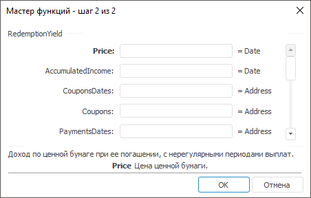

# RedemptionYield: Регламентный отчёт, настольное приложение

RedemptionYield: Регламентный отчёт, настольное приложение
-

# RedemptionYield

[Мастер функций](../../UiReport_Organizational_master_function.htm)
 для функции RedemptionYield выглядит
 следующим образом:

## Синтаксис

RedemptionYield(Price, AccumulatedIncome, CouponsDates,
 Coupons, PaymentDates, Payments, Settlement)

## Параметры

Price. Цена ценной бумаги.
 Значение параметра должно быть больше нуля;

AccumulatedIncome. Накопленный
 доход. Значение параметра должно быть больше, либо равно нулю;

CouponsDates. Даты купонных
 выплат;

Coupons. Процентные ставки
 по купонам. Значение параметра должно быть больше нуля;

PaymentDates. Даты платежей;

Payments. Величины платежей.
 Значение параметра должно быть больше, либо равно нулю;

Settlement. Дата расчета за
 ценные бумаги.

Примечание.
 В качестве параметра можно указывать как непосредственно значение параметра,
 так и адрес ячейки, в которой оно располагается.

## Описание

Возвращает доход по ценной бумаге при ее погашении с нерегулярными периодами
 выплат.

## Комментарии

Функция RedemptionYield - эффективная
 доходность по погашению.

## Пример

		 Формула
		 Результат
		 Описание

		 =RedemptionYield(1150, 40, A1:A5, A6:A10, A11:A12,
		 A13:A14, A15)
		 18,03%
		 Эффективная доходность по погашению на следующих условиях:

			- цена ценной бумаги 1150;

			- накопленный доход 40;

			- даты купонных выплат указаны в диапазоне ячеек A1:A5,
			 значения: 01.01.2006, 01.04.2006, 01.07.2006, 01.10.2006,
			 01.01.2007;

			- процентные ставки по купонам указаны в диапазоне ячеек
			 A6:A10, значения во всех ячейках диапазона одинаковые
			 и равны 80;

			- даты платежей указаны в диапазоне ячеек A11:A12, значения:
			 01.01.2007, 01.04.2007;

			- величины платежей указаны в диапазоне ячеек A13:A14,
			 значения во всех ячейках диапазона одинаковые и равны 500;

			- дата расчета за ценные бумаги указана в ячейке A15,
			 значение 15.12.2005.

См. также:

[Мастер функций](../../UiReport_Organizational_master_function.htm)
 │ [Финансовые
 функции](UiReport_Func_Finance.htm) │ [IFinance.RedemptionYield](MathLib.chm::/Interface/IFinance/IFinance.RedemptionYield.htm)

		Справочная
		 система на версию 10.9
		 от 18/08/2025,
		 © ООО «ФОРСАЙТ»,
