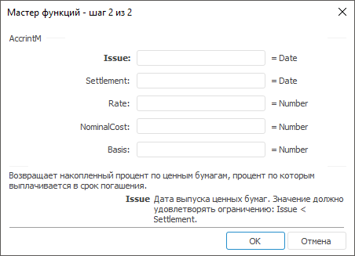
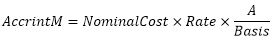

# AccrintM: Регламентный отчёт, настольное приложение

AccrintM: Регламентный отчёт, настольное приложение
-

# AccrintM

[Мастер функций](../../UiReport_Organizational_master_function.htm)
 для функции AccrintM выглядит
 следующим образом:

## Синтаксис

AccrintM( Issue, Settlement, Rate[, NominalCost[,
 Basis])

## Параметры

Issue. Дата выпуска ценных
 бумаг. Значение данного параметра должно быть меньше значения параметра
 Settlement;

Settlement. Дата, срок погашения
 ценных бумаг;

Rate. Годовая процентная ставка
 для купонов по ценным бумагам. Значение параметра должно быть больше нуля;

NominalCost. Номинальная стоимость
 ценных бумаг. Значение параметра должно быть больше нуля. Необязательный
 параметр. Значение по умолчанию 1000;

Basis. Используемый способ
 вычисления дня. Задается в интервале от 0 до 4:

	- 0.
	 Способ вычисления дня американский. 360 дней (метод NSAD). Значение
	 по умолчанию;

	- 1.
	 Способ вычисления дня фактический/фактический;

	- 2.
	 Способ вычисления дня фактический/360 дней;

	- 3.
	 Способ вычисления дня фактический/365 дней;

	- 4.
	 Способ вычисления дня европейский 30/360 дней.

Необязательный параметр.

Примечание.
 В качестве параметра можно указывать как непосредственно значение параметра,
 так и адрес ячейки, в которой оно располагается.

## Описание

Возвращает накопленный процент по ценным бумагам, процент по которым
 выплачивается в срок погашения.

## Комментарии

Значение параметра Issue должно
 быть меньше значения параметра Settlement.

Функция вычисляется по формуле:

,

где:

	- A. Число накопленных
	 дней в соответствии с месячным базисом. Для вычисления дохода на дату
	 погашения используется число дней между датой выпуска Issue
	 и сроком погашения Settlement.

## Пример

		 Формула
		 Результат
		 Описание

		 =AccrintM("12.01.2008",
		 "13.06.2008", 11, 100, 3)
		 461,10
		 Накопленный доход по ценным бумагам на следующих условиях:

			- дата выпуска 12.01.2008;

			- дата погашения 13.06.2008;

			- годовая процентная ставка 11 %;

			- номинальная стоимость 100;

			- способ вычисления дня «фактический/365 дней».

		 =AccrintM(A0, B0, 12.4, 100, 3)
		 927,45
		 Накопленный доход по ценным бумагам на следующих условиях:

			- дата выпуска указана в ячейке A0, значение 01.01.2007;

			- дата погашения указана в ячейке B0, значение 01.10.2007;

			- годовая процентная ставка 12,4 %;

			- номинальная стоимость 100;

			- способ вычисления дня «фактический/365 дней».

См. также:

[Мастер функций](../../UiReport_Organizational_master_function.htm)
 │ [Финансовые
 функции](UiReport_Func_Finance.htm) │ [IFinance.AccrintM](MathLib.chm::/Interface/IFinance/IFinance.AccrintM.htm)

		Справочная
		 система на версию 10.9
		 от 18/08/2025,
		 © ООО «ФОРСАЙТ»,
