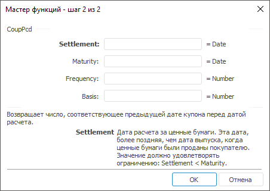

# CoupPcd: Регламентный отчёт, настольное приложение

CoupPcd: Регламентный отчёт, настольное приложение
-

# CoupPcd

[Мастер функций](../../UiReport_Organizational_master_function.htm)
 для функции «CoupPcd» выглядит
 следующим образом:

## Синтаксис

CoupPcd(Settlement, Maturity, Frequency[, Basis])

## Параметры

Settlement. Дата расчета за
 ценные бумаги. Эта дата более поздняя, чем дата выпуска, когда ценные
 бумаги были проданы покупателю;

Maturity. Срок погашения ценных
 бумаг. Эта дата определяет истечение срока действия ценных бумаг;

Frequency. Количество выплат
 по купонам за год. Данный параметр может принимать следующие значения:

	- 1.
	 Ежегодные выплаты;

	- 2.
	 Полугодовые выплаты;

	- 4.
	 Ежеквартальные выплаты;

Basis. Используемый способ
 вычисления дня. Задается в интервале от 0 до 4:

	- 0.
	 Способ вычисления дня американский. 360 дней (метод NSAD). Значение
	 по умолчанию;

	- 1.
	 Способ вычисления дня фактический/фактический;

	- 2.
	 Способ вычисления дня фактический/360 дней;

	- 3.
	 Способ вычисления дня фактический/365 дней;

	- 4.
	 Способ вычисления дня европейский 30/360 дней.

Необязательный параметр.

Примечание.
 В качестве параметра можно указывать как непосредственно значение параметра,
 так и адрес ячейки, в которой оно располагается.

## Описание

Возвращает число, соответствующее предыдущей дате купона перед датой
 расчета.

## Комментарии

Значение параметра Settlement должно
 быть меньше значения параметра Maturity.

Дата соглашения является датой продажи покупателю купона, например облигации.
 Срок платежа представляет собой дату истечения срока действия купона.
 Пусть, например, облигация со сроком действия 30 лет выпущена 1 января
 2008 года и была приобретена покупателем через шесть месяцев после своего
 выпуска. Датой выпуска будет являться 1 января 2008 года, датой расчета
 - 1 июля 2008, а срок погашения такой облигации - 1 января 2038 года,
 то есть через 30 лет после даты.

## Пример

		 Формула
		 Результат
		 Описание

		 =CoupPcd("01.01.2008", "01.06.2008",
		 1)
		 01.06.2007
		 Дата предыдущего купона до даты соглашения, в соответствии
		 со следующими условиями:

			- дата расчета 01.01.2008;

			- срок погашения 01.06.2008;

			- ежегодные выплаты по купонам;

			- используемый способ вычисления дня «американский».

		 =CoupPcd(A0, B0, 1,4)
		 20.07.2006
		 Дата предыдущего купона до даты соглашения, в соответствии
		 со следующими условиями:

			- дата расчета указана в ячейке A0, значение 01.01.2007;

			- срок погашения указан в ячейке B0, значение 01.10.2007;

			- ежегодные выплаты по купонам;

			- используемый способ вычисления дня «европейский 30/360
			 дней».

См. также:

[Мастер
 функций](../../UiReport_Organizational_master_function.htm) │ [Финансовые функции](UiReport_Func_Finance.htm)
 │ [CoupDayBs](UiReport_Func_Finance_CoupDayBs.htm)
 │ [CoupDays](UiReport_Func_Finance_CoupDays.htm)
 │ [CoupDaysNc](UiReport_Func_Finance_CoupDaysNc.htm)
 │ [CoupNcd](UiReport_Func_Finance_CoupNcd.htm)
 │ [CoupNum](UiReport_Func_Finance_CoupNum.htm)
 | [IFinance.CoupNum](MathLib.chm::/Interface/IFinance/IFinance.CoupNum.htm)

		Справочная
		 система на версию 10.9
		 от 18/08/2025,
		 © ООО «ФОРСАЙТ»,
