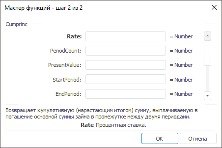

# Cumprinc: Регламентный отчёт, настольное приложение

Cumprinc: Регламентный отчёт, настольное приложение
-

# Cumprinc

[Мастер функций](../../UiReport_Organizational_master_function.htm)
 для функции Cumprinc выглядит
 следующим образом:

## Синтаксис

Cumprinc(Rate, PaymentCount, PresentValue, StartPeriod,
 EndPeriod, Type)

## Параметры

Rate. Процентная ставка. Значение
 параметра должно быть больше нуля;

PaymentCount. Общее количество
 периодов выплат. Значение параметра должно быть больше нуля;

PresentValue. Стоимость инвестиций
 на текущий момент;

StartPeriod. Номер первого
 периода, включаемого в вычисления;

EndPeriod. Номер последнего
 периода, включаемого в вычисления;

Type. Выбор времени платежа.
 Параметр может принимать одно из значений:

	- 0.
	 Платеж в конце периода;

	- 1.
	 Платеж в начале периода.

Примечание.
 В качестве параметра можно указывать как непосредственно значение параметра,
 так и адрес ячейки, в которой оно располагается.

## Описание

Возвращает кумулятивную, нарастающим итогом, сумму, выплачиваемую в
 погашение основной суммы займа в промежутке между двумя периодами.

## Комментарии

Периоды выплат нумеруются начиная с 1.

## Пример

		 Формула
		 Результат
		 Описание

		 =Cumprinc(0.01, 24, 12000, 1, 1, 0)
		 -444,88
		 Кумулятивная выплата, в соответствии со следующими условиями:

			- процентная ставка 0.01;

			- общее количество периодов выплат 24;

			- стоимость инвестиций на текущий момент 12000;

			- номер первого периода 1;

			- номер последнего периода, включаемого в вычисления 1;

			- выбор времени платежа «в конце периода».

		 =Cumprinc(A0, B0, 12000, 1,1,1)
		 6000,00
		 Кумулятивная выплата, в соответствии со следующими условиями:

			- процентная ставка указана в ячейке A0, значение 1;

			- общее количество периодов выплат указано в ячейке B0,
			 значение 36;

			- стоимость инвестиций на текущий момент 12000;

			- номер первого периода 1;

			- номер последнего периода, включаемого в вычисления 1;

			- выбор времени платежа «в начале периода».

См. также:

[Мастер функций](../../UiReport_Organizational_master_function.htm)
 │ [Финансовые
 функции](UiReport_Func_Finance.htm) │ [CumIpmt](UiReport_Func_Finance_Cumipmt.htm)
 │ [IFinance.Cumprinc](MathLib.chm::/Interface/IFinance/IFinance.Cumprinc.htm)

		Справочная
		 система на версию 10.9
		 от 18/08/2025,
		 © ООО «ФОРСАЙТ»,
