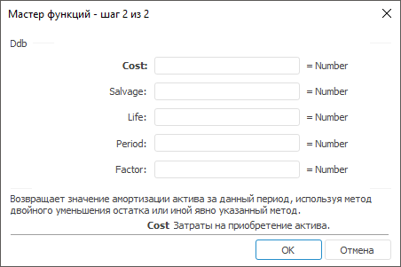

# Ddb: Регламентный отчёт, настольное приложение

Ddb: Регламентный отчёт, настольное приложение
-

# Ddb

[Мастер функций](../../UiReport_Organizational_master_function.htm)
 для функции Ddb выглядит следующим
 образом:

## Синтаксис

Ddb(Cost, Salvage, Life, Period[, Factor])

## Параметры

Cost. Затраты на приобретение
 актива;

Salvage. Стоимость в конце
 периода амортизации;

Life. Количество периодов,
 за которые собственность амортизируется;

Period. Период, для которого
 требуется вычислить амортизацию. Период должен быть задан в тех же единицах
 измерения, что и параметр Life;

Factor. Процентная ставка снижающегося
 остатка. Необязательный параметр. Значение по умолчанию 2.

Примечание.
 В качестве параметра можно указывать как непосредственно значение параметра,
 так и адрес ячейки, в которой оно располагается.

## Описание

Параметр Period должен быть
 задан в тех же единицах измерения, что и параметр Life.

Возвращает значение амортизации актива за данный период, используя метод
 двойного уменьшения остатка или иной явно указанный метод.

Функция Ddb вычисляет амортизацию,
 используя увеличенный коэффициент. Амортизация максимальна в первый период,
 в последующие периоды уменьшается. Функция Ddb
 использует следующую формулу для вычисления амортизации за период:

((Cost - Salvage) - суммарная амортизация
 за предшествующие периоды) * (Factor/Life).

Если нужно использовать другой метод вычисления амортизации, измените
 значение параметра Factor.

## Пример

		 Формула
		 Результат
		 Описание

		 =Ddb(5000, 100, 12, 1)
		 833,33
		 Амортизация за первый период.

		 =Ddb(54000, 1200, 24, B6,7)
		 2808,46
		 Амортизация за период, указанный в ячейке B6. Ячейка B6 содержит
		 значение 6.

См. также:

[Мастер функций](../../UiReport_Organizational_master_function.htm)
 │ [Финансовые
 функции](UiReport_Func_Finance.htm) │ [Db](UiReport_Func_Finance_Db.htm)
 │ [Sln](UiReport_Func_Finance_Sln.htm)
 │ [Syd](UiReport_Func_Finance_Syd.htm)
 │ [Vdb](UiReport_Func_Finance_Vdb.htm)
 │ [IFinance.Ddb](MathLib.chm::/Interface/IFinance/IFinance.Ddb.htm)

		Справочная
		 система на версию 10.9
		 от 18/08/2025,
		 © ООО «ФОРСАЙТ»,
