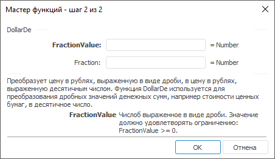

# DollarDe: Регламентный отчёт, настольное приложение

DollarDe: Регламентный отчёт, настольное приложение
-

# DollarDe

[Мастер функций](../../UiReport_Organizational_master_function.htm)
 для функции DollarDe выглядит
 следующим образом:

## Синтаксис

DollarDe(FractionValue, Fraction)

## Параметры

FractionValue. Десятичное число.
 Значение данного параметра должно быть больше, либо равно нулю;

Fraction. Целое, которое нужно
 использовать в качестве знаменателя. Значение данного параметра должно
 быть не равно нулю.

Примечание.
 В качестве параметра можно указывать как непосредственно значение параметра,
 так и адрес ячейки, в которой оно располагается.

## Описание

Преобразует цену в рублях, выраженную в виде дроби, в цену в рублях,
 выраженную в десятичным числом.

## Комментарии

Функция используется для преобразования дробных значений денежных сумм,
 например стоимости ценных бумаг, в десятичное число.

## Пример

		 Формула
		 Результат
		 Описание

		 =DollarDe(1.02, 16)
		 1,125
		 Преобразует число 1,02, читаемое как 1 целая и 2/16, в десятичное
		 число.

		 =DollarDe(A0, B0)
		 13,25
		 Преобразует дробь, заданную в ячейках A0 и B0 в десятичное
		 число. Ячейка A0 содержит значение 12,5, B0 - 4.

См. также:

[Мастер функций](../../UiReport_Organizational_master_function.htm)
 │ [Финансовые
 функции](UiReport_Func_Finance.htm) │ [DollarFr](UiReport_Func_Finance_DollarFr.htm)
 │ [IFinance.DollarDe](MathLib.chm::/Interface/IFinance/IFinance.DollarDe.htm)

		Справочная
		 система на версию 10.9
		 от 18/08/2025,
		 © ООО «ФОРСАЙТ»,
