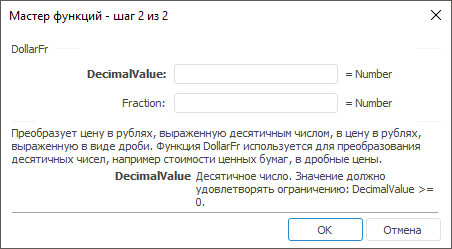

# DollarFr: Регламентный отчёт, настольное приложение

DollarFr: Регламентный отчёт, настольное приложение
-

# DollarFr

[Мастер функций](../../UiReport_Organizational_master_function.htm)
 для функции DollarFr выглядит
 следующим образом:

## Синтаксис

DollarFr(FractionValue, Fraction)

## Параметры

FractionValue. Десятичное число.
 Значение данного параметра должно быть больше, либо равно нулю;

Fraction. Целое, которое нужно
 использовать в качестве знаменателя. Значение данного параметра должно
 быть не равно нулю.

Примечание.
 В качестве параметра можно указывать как непосредственно значение параметра,
 так и адрес ячейки, в которой оно располагается.

## Описание

Преобразует цену в рублях, выраженную десятичным числом, в цену в рублях,
 выраженную в виде дроби.

## Комментарии

Функция используется для преобразования десятичных чисел, например стоимости
 ценных бумаг, в дробные цены.

## Пример

		 Формула
		 Результат
		 Описание

		 =DollarFr(1.125, 16)
		 1,02
		 Преобразует число 1,125, в число, читаемое как 1 целая и 2/16.

		 =DollarFr(A0, 32)
		 1,04
		 Преобразует число, заданное в ячейке A0 в число, читаемое как
		 1 целая и 1/8. Ячейка A0 содержит значение 1,125.

См. также:

[Мастер функций](../../UiReport_Organizational_master_function.htm)
 │ [Финансовые
 функции](UiReport_Func_Finance.htm) │ [DollarDe](UiReport_Func_Finance_DollarDe.htm)
 │ [IFinance.DollarFr](MathLib.chm::/Interface/IFinance/IFinance.DollarFr.htm)

		Справочная
		 система на версию 10.9
		 от 18/08/2025,
		 © ООО «ФОРСАЙТ»,
