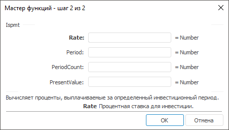

# Ispmt: Регламентный отчёт, настольное приложение

Ispmt: Регламентный отчёт, настольное приложение
-

# Ispmt

[Мастер функций](../../UiReport_Organizational_master_function.htm)
 для функции Ispmt выглядит следующим
 образом:

## Синтаксис

Ispmt(Rate, Period, PeriodCount, PresentValue)

## Параметры

Rate. Процентная ставка для
 инвестиции;

Period. Период, для которого
 требуется найти прибыль. Значение данного параметра больше нуля и меньше
 или равно значению параметра PeriodCount;

PeriodCount. Общее число периодов
 выплат для данной инвестиции;

PresentValue. Стоимость инвестиции
 на текущий момент. Для займа PresentValue
 - это сумма займа.

Примечание.
 В качестве параметра можно указывать как непосредственно значение параметра,
 так и адрес ячейки, в которой оно располагается.

## Описание

Возвращает проценты, выплачиваемые за определенный инвестиционный период.

## Комментарии

Все аргументы, означающие денежные средства, которые должны быть выплачены
 (например, сберегательные вклады), представляются отрицательными числами;
 денежные средства, которые должны быть получены (например, дивиденды),
 представляются положительными числами.

## Пример

		 Формула
		 Результат
		 Описание

		 =Ispmt(0.15, 1, 12, 1200)
		 -165,00
		 Проценты, выплачиваемые за определенный инвестиционный период,
		 в соответствии со следующими условиями:

			- процентная ставка за период 0,15;

			- период 1;

			- общее число периодов 12;

			- стоимость инвестиций 1200.

		 =Ispmt(A0, 2, 14, B0)
		 -1120,96
		 Проценты, выплачиваемые за определенный инвестиционный период,
		 в соответствии со следующими условиями:

			- процентная ставка за период указана в ячейке A0 (значение
			 0,9);

			- период 2;

			- общее число периодов 14;

			- стоимость инвестиций указана в ячейке B0 (значение 1453,1).

См. также:

[Мастер функций](../../UiReport_Organizational_master_function.htm)
 │ [Финансовые
 функции](UiReport_Func_Finance.htm) │ [Ipmt](UiReport_Func_Finance_Ipmt.htm)
 │ [IFinance.Ispmt](MathLib.chm::/Interface/IFinance/IFinance.Ispmt.htm)

		Справочная
		 система на версию 10.9
		 от 18/08/2025,
		 © ООО «ФОРСАЙТ»,
